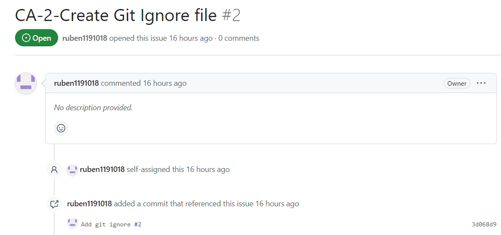
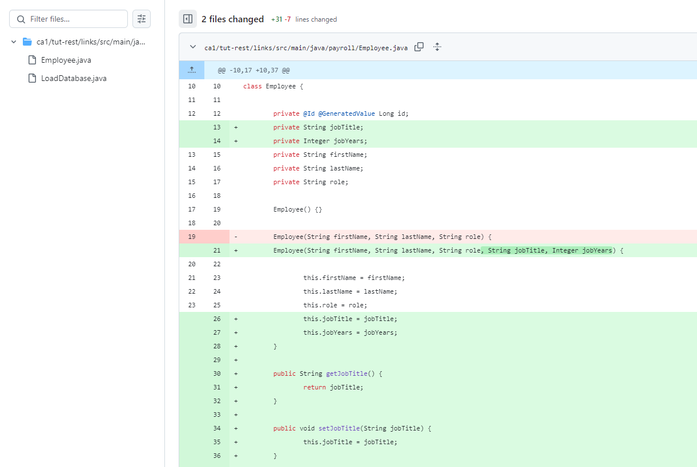
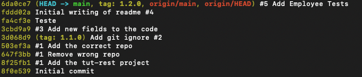
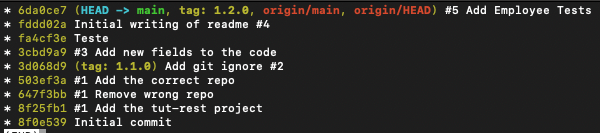
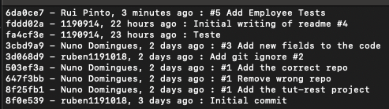
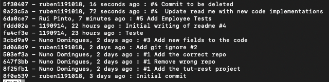
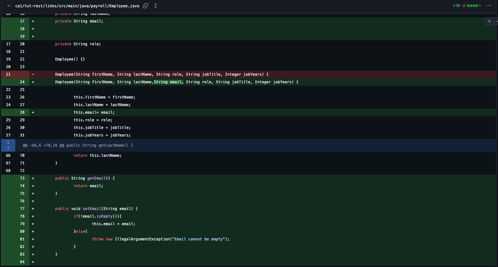
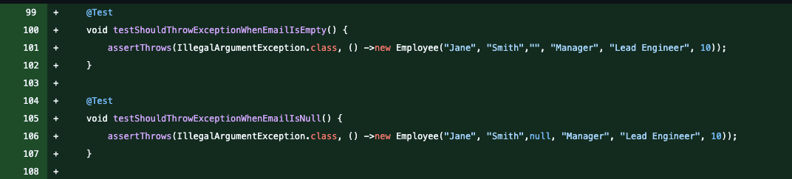
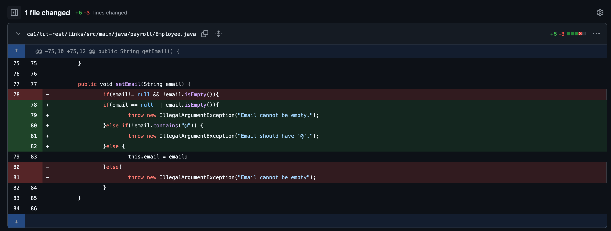
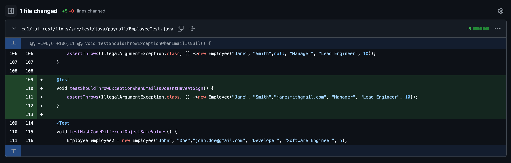

# CA1 Report

## Part 1 ( No branches )

### Step 1: Setting Up the Project
Firstly we cloned the project with the following command
    
    git clone https://github.com/ruben1191018/cogsi-1190914-1191018-1191042.git

We began by copying the "Building REST Services with Spring" application into a new 
directory (ca1). After that, we created the first issue to track progress.

### Step 2: Initial Commit
With the issue in place, we proceeded with the initial commit. We used a smart commit referring to the issue created before. The steps were as follows:

- git pull – to ensure the latest version of the repository is up-to-date.
- git add . – to stage the newly added files. 
- git commit -m "#1 Add the tut-rest project" – to commit the changes.
- git push – to push the commit to the repository.

### Step 3: Adding .gitignore
After this, we created Issue 2, which involved adding a .gitignore file to the project:

- git pull – to fetch the latest changes.
- git add .gitignore – to stage the .gitignore file.
- git commit -m "Add git ignore #2" 
- git push – to push the commit.

### Step 4: Tag Creation

After completing the initial setup and configuration, we created and pushed the tag 1.1.0 for the project with the following commands

    git tag -a 1.1.0 3d068d9
    git push origin 1.1.0

### Step 5: Project Enhancements
Subsequently, a change was made to the project links by adding two new fields to the Employee model. The necessary support for these new fields was also implemented.

Commit - https://github.com/ruben1191018/cogsi-1190914-1191018-1191042/commit/3cbd9a96165e61629aad6a4fa2c62b6253c35490

- git pull – to fetch the latest changes.
- git add . – to stage all the changes
- git commit -m "#3 Add new fields to the code"
- git push – to push the changes.

After the code was implemented we added the tests
- git add . – to stage all the changes
- git commit -m "#5 Add Employee tests"
- git push – to push the changes.

And we created and pushed the new tag with the new minor version

    git tag 1.2.0
    git push origin 1.2.0

### Step 6: Git Log

After all the changes we used different git log commands to view the commit history:

To show the information in a compact way

- git log --oneline- 

To show the commits in graph form

     git log --graph --oneline 

To show the commit in a formatter way with the id of the commit, name of who commited, time it was done and the name of the commit

    git log --pretty=format:"%h - %an, %ar : %s"

To test the revert command

### Step 7: Git Revert

To test the revert command we created a commit (only adding on new line in a file) so we could revert to it

After that we reverted to that commit with the following command

    git revert 5f3040778133cc7ca2e7e715bb30e8c6aeafda73

### Step 8: Add final git tag for part 1

    git tag ca1-part1
    git push origin ca1-part1

## Part 2- Branches

### Step 1: Create branch named email-field

To create the branch we used the following command:

    git checkout -b email-field

### Step 2: Add support for an email field for and employee 

After that we implemented the new email field in the class employee

Commit- https://github.com/ruben1191018/cogsi-1190914-1191018-1191042/commit/ea946816cb221b029499abe1d377e461ccbc801a

    git commit -m "#6 Add new email field"

### Step 3: Add unit tests
Commit - https://github.com/ruben1191018/cogsi-1190914-1191018-1191042/commit/a43664bce078cfd8269578ff24f8dbc53c4c41f1

    git commit -m "#7 Add test for null and empty email"

### Step 4: Merge branch into main

After the changes and tests were implemented we merged the branch in main with the following commands:

Checkout to main:
 
    git checkout main

Merge the email-field branch
    
    git merge email-field

Push the changes to the remote repository 

    git push

### Step 5: Add new tag 1.3.0

    git tag 1.3.0
    git push 1.3.0

### Step 6: Create branch named fixing-invalid-email

To create the branch we used the following command:

    git checkout -b fixing-invalid-email

### Step 7: Add email validation for At Sign (@)

After that we implemented the email validation in the class employee

Commit- https://github.com/ruben1191018/cogsi-1190914-1191018-1191042/commit/865be3c3f10ab72439a6643dc12d8a94ff77d07c

    git commit -m "#8 Add email validation Update Employee.java"

### Step 8: Add unit tests
Commit - https://github.com/ruben1191018/cogsi-1190914-1191018-1191042/commit/27ec0f38827f8763fb66b3d50f54c493ab7be605

    git commit -m "#9 Add tests for email sign validation"

### Step 9: Merge branch into main

After the changes and tests were implemented we merged the branch in main with the following commands:

Checkout to main:

    git checkout main

Merge the fixing-invalid-email branch

    git merge fixing-invalid-email

Push the changes to the remote repository

    git push

### Step 10: Add new tag 1.3.1

    git tag 1.3.1
    git push 1.3.1

### Step 11: Resolve conflicts 

When we do:
    
    git merge fixing-invalid-email

The git detects conflicting changes.

Identify the conflicting files:
    
    git status

Edit the conflicting files where the markers (<<<<<<, ======, >>>>>>) are and remove them.
After resolving the conflicts:
    
    git add . 
    git commit

And in the end:
    
    git push origin main

# Alternative solution

For the alternative solution we chose Mercurial which is also a free, distributed source control management tool

## Comparison between both technologies

Git and Mercurial are both distributed version control systems widely used for software development. While they share many similar features, such as distributed repositories, efficient version tracking, and powerful merging capabilities, but there are some differences

Below is a  comparison of Git and Mercurial focusing on version control features:

1. Repository Model and Distribution

 - Git: Git is a distributed version control system where each user has a complete copy of the repository's history. This allows for offline work and distributes workload among contributors.
Git uses a content-addressable storage model, meaning files are referenced by a SHA-1 hash that uniquely identifies the content, providing extra security against data corruption.

- Mercurial:Like Git, Mercurial is distributed, allowing each user to have a full copy of the repository. This enables developers to commit, branch, and merge locally and offline.
Mercurial organizes history using numbered revisions, which are incremental, making it easier for new users to understand compared to Git’s hash system.

- Summary: Both are distributed, but Git uses hashes to identify commits, while Mercurial uses numbered revisions, offering more readable history in Mercurial.

2. Branch Handling
- Git: Git is known for its robust branching system. Branches in Git are lightweight and efficient, allowing developers to create, switch, and merge branches quickly.
Each branch in Git is essentially a pointer to a specific commit, making it easy to manipulate the development history.
Branches in Git are local by default, meaning they don't affect the remote repository until explicitly pushed.

- Mercurial: Mercurial supports branching but in a different way. There are two main types of branches: named branches and anonymous branches (or heads). Named branches are permanent and part of the history, while anonymous branches are created automatically in certain cases.
Mercurial’s approach to branching is more conservative, focusing on maintaining a clean history. Named branches cannot be deleted once created, which can be a problem if you want to discard a temporary or experimental branch.

- Summary: Git offers more flexibility with temporary branches, whereas Mercurial’s approach is more rigid and conservative, with permanent named branches.

3. Performance and Scalability
  

-  Git: Git is designed for speed, particularly in large projects with many files and commits. Its distributed structure enables very fast local operations, such as commits and merges, since there's no need to communicate with a remote server.
Git’s performance shines when handling a large number of branches and commits, making it the preferred choice for large-scale open-source projects, such as the Linux kernel.

- Mercurial: Mercurial is also efficient and fast, but in some scenarios (such as handling a large number of branches or binary files), Git can outperform it. Mercurial tends to perform better in smaller repositories with a moderate number of branches.
In very large repositories, Git generally provides slightly better performance.

- Summary: Both are fast, but Git tends to outperform Mercurial in large projects with many branches and commits.

4. Merging and Conflict Resolution
   
- Git:Git offers powerful merging capabilities and is known for its flexibility in resolving conflicts. Git can automatically resolve most merge conflicts but also provides detailed tools for manual conflict resolution when necessary.
Git supports various merge options, including three-way merges and rebase, which allows users to rewrite commit history to keep it clean.

- Mercurial: Mercurial also handles merging well, with support for automatic merges. However, its approach to rebasing and rewriting history is more limited and conservative, as Mercurial places value on preserving the original history.
Mercurial supports three-way merges but offers fewer advanced options compared to Git.

- Summary: Git offers more flexibility for merging and conflict resolution, including rebase, while Mercurial takes a simpler and more conservative approach.

5. Learning Curve and Usability 

- Git: Git has a steeper learning curve, especially for beginners. Its commands and operational logic can be more complex to grasp at first, particularly around branch management, commits, and rebase operations.
However, Git offers tremendous power and flexibility for advanced users, making it the top choice for large teams and complex projects.

- Mercurial: Mercurial was designed with simplicity in mind, and many consider it to have a gentler learning curve compared to Git. Its commands are more straightforward and consistent, making it easier for new users to pick up.
On the downside, Mercurial sacrifices some flexibility and power in favor of simplicity.

- Summary: Git is more complex but powerful, while Mercurial is easier to learn and use, especially for less experienced users.

6. Tooling and Ecosystem

- Git: Git has a rich ecosystem with numerous integrations, such as GitHub, GitLab, and Bitbucket. These platforms provide robust support for version control, code reviews, continuous integration, and automated deployment.
Git also has deep integration with many IDEs and development tools, making it a practical choice for developers.

- Mercurial:Mercurial is also supported by platforms like Bitbucket and SourceForge, but its ecosystem is smaller compared to Git.
While Mercurial offers good integration, particularly with Bitbucket, Git enjoys broader support across various development tools and CI/CD platforms.

- Summary: Git has a larger and richer ecosystem with more integrations into modern development tools, while Mercurial has a smaller but still functional ecosystem.

Conclusion:

Git offers more flexibility, power, and scalability, making it suitable for large projects and distributed teams that require complex workflows. However, it comes with a steeper learning curve.
Mercurial is simpler and easier to use, making it ideal for small projects or teams that prefer a more straightforward approach to version control, without needing to manage complex workflows.
Both tools are efficient and powerful for version control, and the choice between them depends on the specific needs of the project and the familiarity of the team with distributed version control systems.

