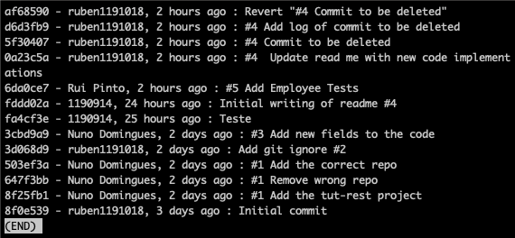

# CA1 Report

## Part 1 ( No branches )

### Step 1: Setting Up the Project
Firstly we cloned the project with the following command
    
    git clone https://github.com/ruben1191018/cogsi-1190914-1191018-1191042.git

We began by copying the "Building REST Services with Spring" application into a new 
directory (ca1). After that, we created the first issue to track progress.

### Step 2: Initial Commit
With the issue in place, we proceeded with the initial commit. We used a smart commit referring to the issue created before. The steps were as follows:

- git pull – to ensure the latest version of the repository is up-to-date.
- git add . – to stage the newly added files. 
- git commit -m "#1 Add the tut-rest project" – to commit the changes.
- git push – to push the commit to the repository.

### Step 3: Adding .gitignore
After this, we created Issue 2, which involved adding a .gitignore file to the project:

- git pull – to fetch the latest changes.
- git add .gitignore – to stage the .gitignore file.
- git commit -m "Add git ignore #2" 
- git push – to push the commit.

### Step 4: Tag Creation

After completing the initial setup and configuration, we created and pushed the tag 1.1.0 for the project with the following commands

    git tag -a 1.1.0 3d068d9
    git push origin 1.1.0

### Step 5: Project Enhancements
Subsequently, a change was made to the project links by adding two new fields to the Employee model. The necessary support for these new fields was also implemented.

Commit - https://github.com/ruben1191018/cogsi-1190914-1191018-1191042/commit/3cbd9a96165e61629aad6a4fa2c62b6253c35490

- git pull – to fetch the latest changes.
- git add . – to stage all the changes
- git commit -m "#3 Add new fields to the code"
- git push – to push the changes.

After the code was implemented we added the tests
- git add . – to stage all the changes
- git commit -m "#5 Add Employee tests"
- git push – to push the changes.

And we created and pushed the new tag with the new minor version

    git tag v1.2.0
    git push origin v1.2.0

### Step 6: Git Log

After all the changes we used different git log commands to view the commit history:

To show the information in a compact way

- git log --oneline- 

To show the commits in graph form

     git log --graph --oneline 

To show the commit in a formatter way with the id of the commit, name of who commited, time it was done and the name of the commit

    git log --pretty=format:"%h - %an, %ar : %s"

To test the revert command

### Step 7: Git Revert

To test the revert command we created a commit (only adding on new line in a file) so we could revert to it

After that we reverted to that commit with the following command

    git revert 5f3040778133cc7ca2e7e715bb30e8c6aeafda73

