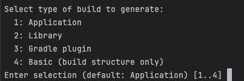
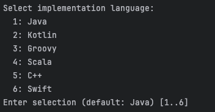
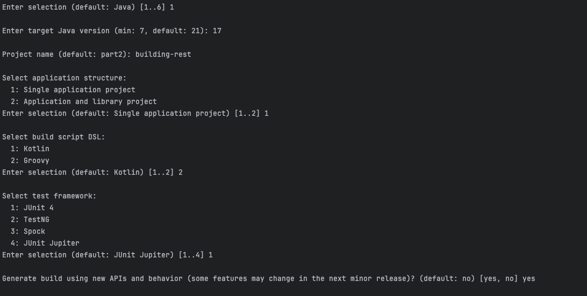
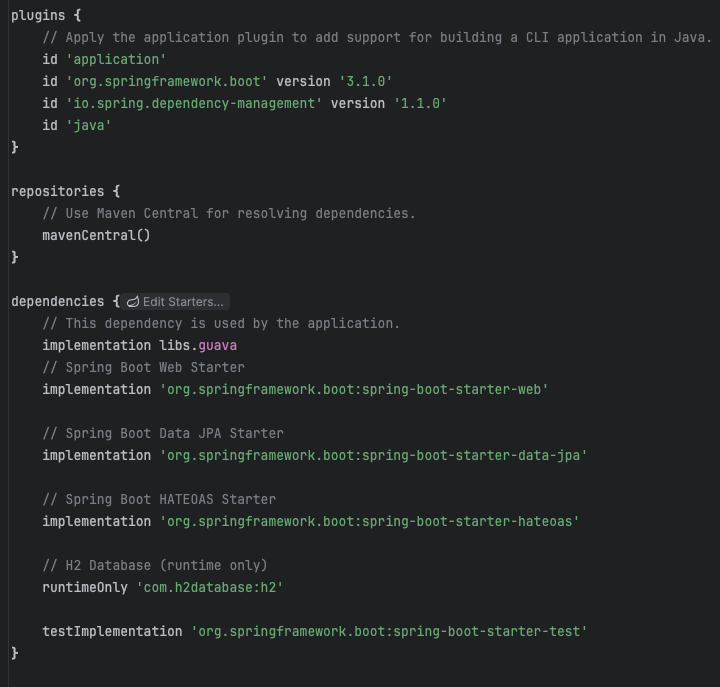
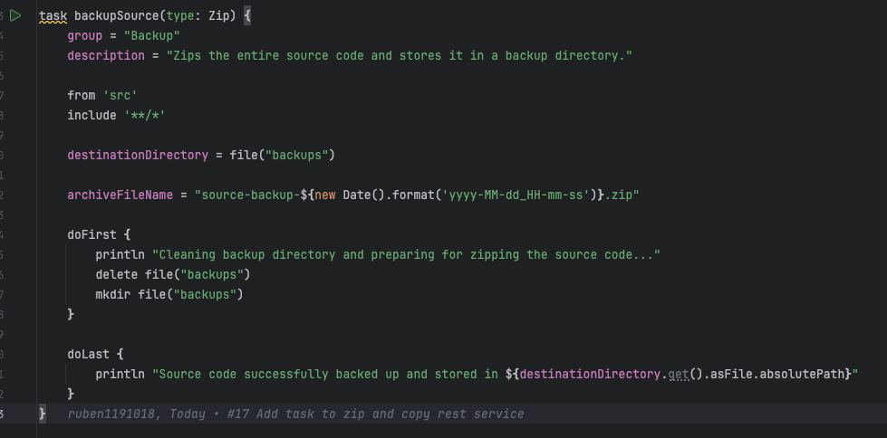
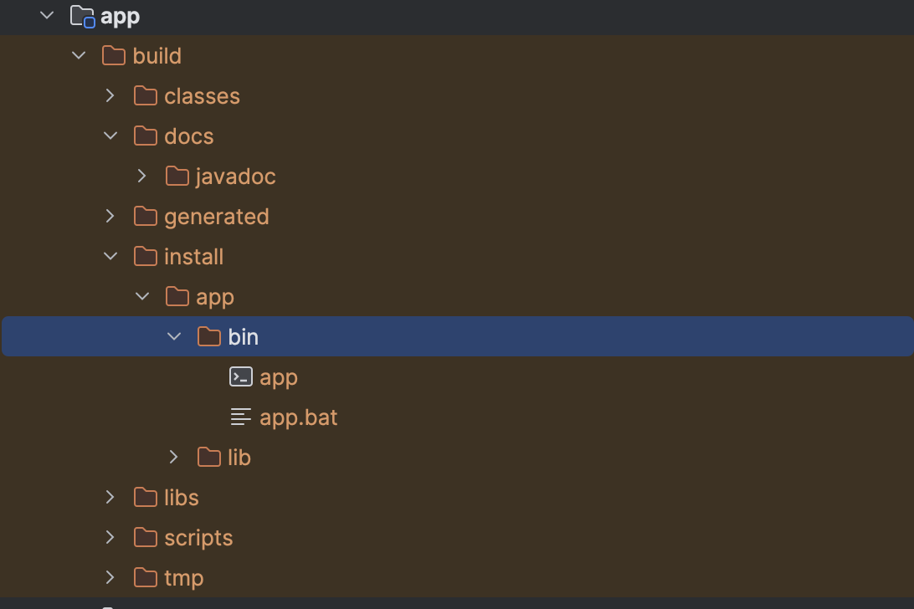
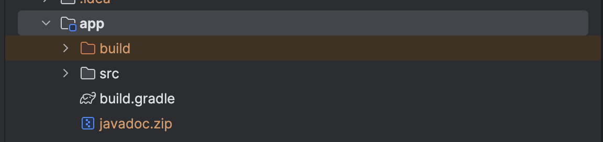
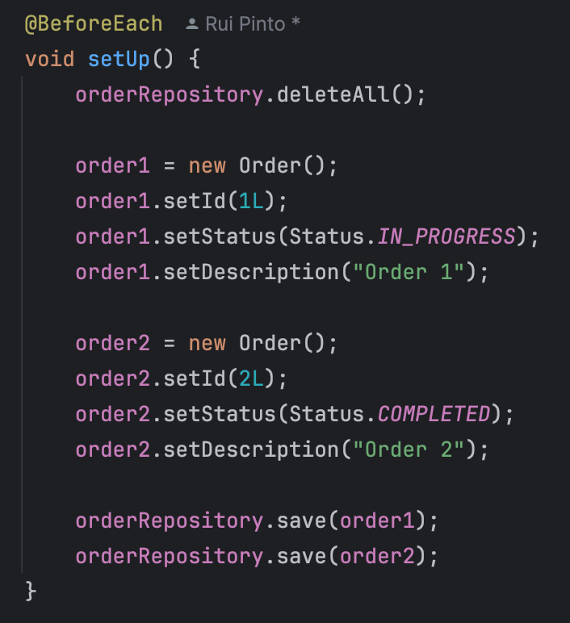
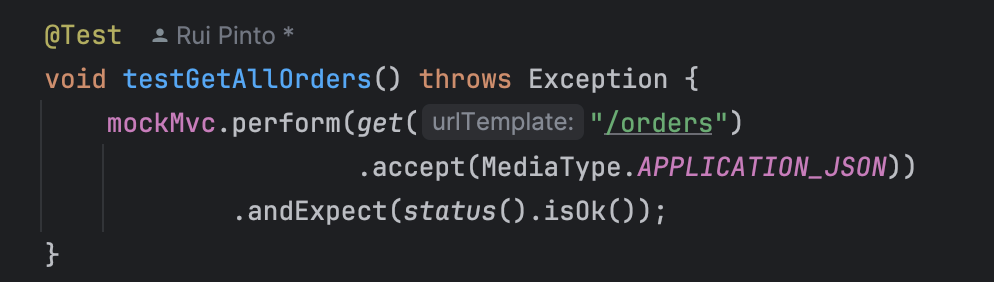

## Part 2

### Step 1 Convert building Rest Services to Gradle (instead of Maven)

In the empty directory we used the gradle init command to create a Gradle Project
The following options were shown:

We selected "Application" (1)

Then selected "Java" (1)

For the application structure we went with Single Application Project (1) since we don't want to create a library 
We used Groovy (2) as the build script DSL following the same structure as the first part

For the test framework we used JUnit 4 (1) following the same approach as the first part 

After having the base Gradle project we replaced the *src* folder with the one from the Building Rest Services

Some dependencies were missing, so we added the same dependencies from the pom.xml into the build.gradle file: 

We had to add plugins and dependencies

The plugins section in Gradle is used to apply plugins to the project. Plugins extend the capabilities of the build system by adding tasks, conventions, and behavior. Plugins can be used for different purposes, like building Java applications, managing dependencies, deploying applications, running tests, and more.

We added "org.springframework.boot", which helps building and packaging Spring Boot Applications, it adds useful tasks like bootRun, bootJar...
We also added "io.spring.dependency-management" which helps manage dependency versions in a more centralized way
And also added "java" which applies the Java Plugin, that adds tasks to compile Java code (compileJava), runTests(test) and package the project into a Jar (jar)

After adding the plugins we added the same dependencies present in the pom.xml

### Step 2 - Create Custom task to zip source code and store in back up directory 

To zip source code and store in back up directory we added the new following task called backupSource:

This task is of type Zip meaning it compresses files into a zip file

It takes all the files in the src directory

And the zip file is saved in a directory called backups

Before zipping, the doFirst block cleans up the old backups and recreates a new directory

After the task finishes, the doLast block prints a message indicating the source code has been backed up along with the location of the zip file

### Step 3 - Create a custom task that depends on the installDist task and runs the application using the generated distribution scripts

To do this we added the new following task called runDistApp:
    
    task runDistApp(type: Exec){
        group = "Application"
        description = "Runs the application using the generated distribution scripts."
    
        dependsOn installDist
    
        def os = org.gradle.internal.os.OperatingSystem.current()
    
        def appDir = "$buildDir/install/${project.name}/bin"
        def execScript
    
        if (os.isWindows()) {
            execScript = "${appDir}/${project.name}.bat"
        } else {
            execScript = "${appDir}/${project.name}"
        }
    
        println "Running the application using: $execScript"
    
        executable = execScript
    }

- dependsOn installDist: This ensures that the installDist task is executed before the custom task (runDistApp). The installDist task generates the necessary distribution files and scripts under the build/install directory.

- org.gradle.internal.os.OperatingSystem.current(): This Gradle API helps in detecting the current operating system, which is used to choose the correct executable script (either .bat for Windows or .sh for Unix-based systems).

- appDir: This variable contains the path to the generated distribution scripts

- Determine Script Path: Based on the operating system, the script to run is selected. For Windows, it's a .bat file, and for other OSes, it's a .sh file.

- executable: Since this is a Exec Type, we define the correct script file as the executable.

To run this:

./gradlew runDistApp

### Step 4 - Create a custom task that depends on the javadoc task, which generates the Javadoc for your project, and then packages the generated documentation into a zip file

To do this we added the new following task called packageJavadoc:
    
    task packageJavadoc(type: Zip) {
        group = "Documentation"
        description = "Generates Javadoc and packages it into a ZIP file."
    
        dependsOn javadoc
    
        from javadoc.destinationDir
    
        destinationDirectory = file("$rootDir/app")
    
        archiveFileName = "javadoc.zip"
    
        doLast {
            println "Javadoc has been generated and packaged into $destinationDirectory/javadoc.zip"
        }
    }

- dependsOn javadoc: This makes the packageJavadoc task depend on the javadoc task. Gradle will run the javadoc task first to generate the documentation before executing this task.

- from javadoc.destinationDir: This defines the source directory for the ZIP file as the output of the javadoc task. The javadoc.destinationDir holds the path where the generated Javadoc is stored.

- destinationDirectory = file("$$rootDir/docs"): This specifies where the ZIP file will be stored. In this case, it will be placed in the app folder.

- archiveFileName = "javadoc.zip": This sets the name of the ZIP file that will be created.

### Step 5 - Create a new source set for integration tests

To start working on the integration tests we had to make sure we had the correct the dependencies:
    
    testImplementation 'org.springframework.boot:spring-boot-starter-test'

This dependency is a starter for testing Spring Boot applications with libraries including JUnit Jupiter, Hamcrest and Mockito

We also added the following configuration to use JUnit Platform as the test engine.

    test {
        useJUnitPlatform()
    }

We developed an integration test for the Get All Orders endpoint. To prepare for each test, we introduced a setUp method annotated with @BeforeEach,
which ensures a clean test environment. 
This method clears all existing records from the database
, then creates and saves two new orders with distinct statuses and descriptions.
By resetting the database and populating it with fresh data, we ensure consistent test
results.

After that we created a method to perform the Get All Orders and validate that the response was Ok 200.
