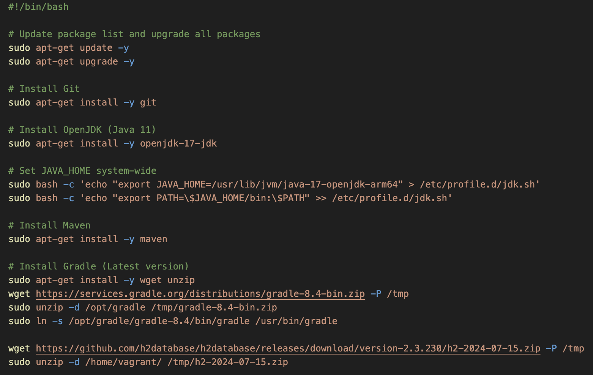
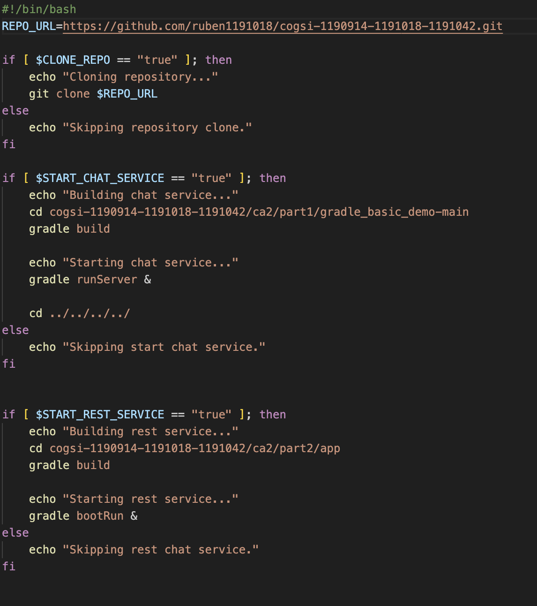
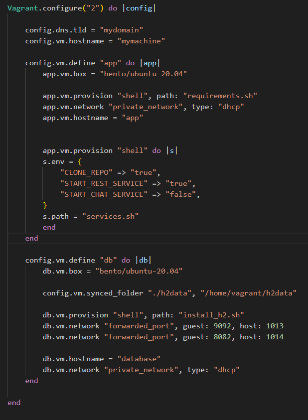
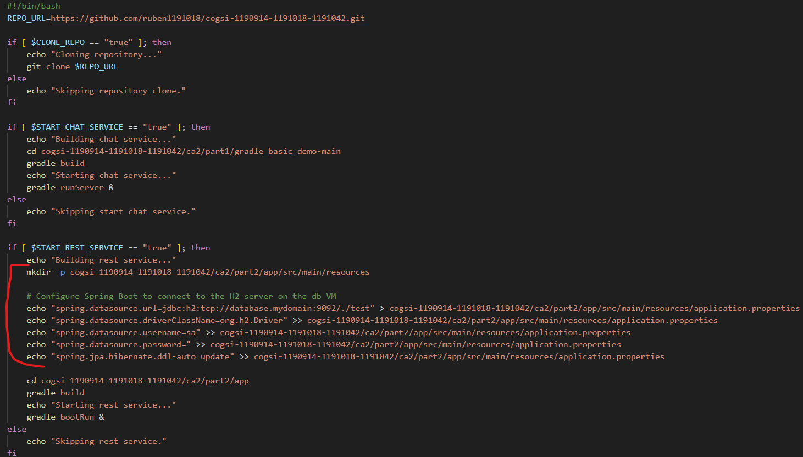
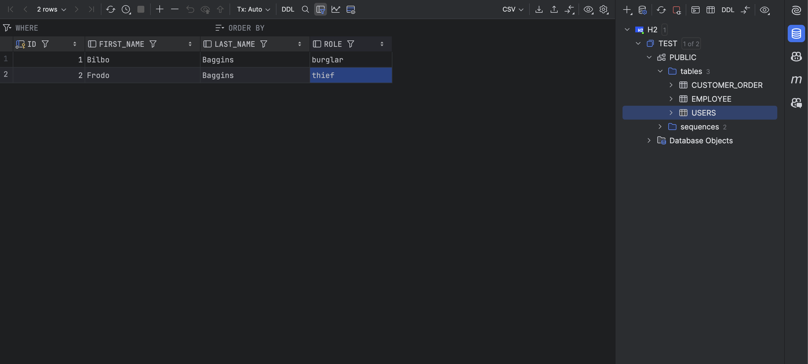
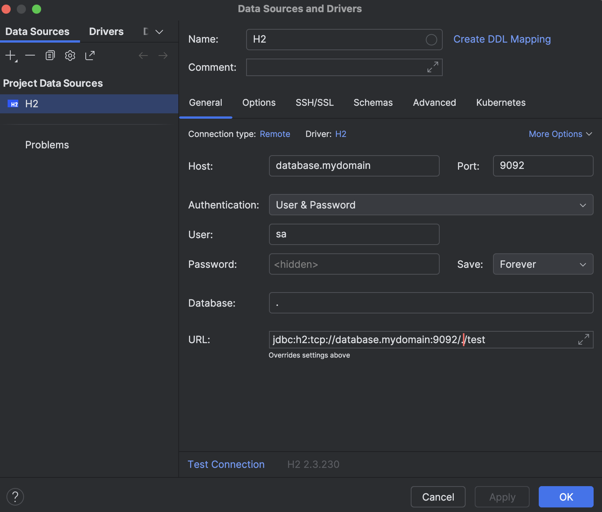
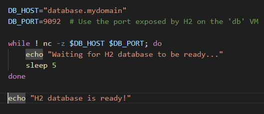

# CA3

## Part 1

###  Create a VM using Vagrant

We started by running the following command for initializing a project to use a base image to quickly clone a VM:
    
    vagrant init bento/ubuntu-20.04

This command generates a vagrant file with all the initial configurations.

To automate the installation of all necessary dependencies for the project, we created a shell script called requirements.sh. This script updates the package list, upgrades existing packages, and installs all required dependencies. The key packages installed are:
  
    * git
    * openjdk-17-jdk
    * maven
    * gradle

We also set the JAVA_HOME variable.

After we built the script, we added the following command to the vagrant file:
    
    config.vm.provision "shell", path: "requirements.sh"

This setting instructs Vagrant to run the requirements.sh script automatically upon VM creation, ensuring that all dependencies are installed without manual intervention

to validate that the VM setup and dependency installations were successful, we performed a series of commands:

Start the VM - We used the command below to boot up the VM with all configurations and provisions specified in the Vagrantfile.
    
    vagrant up

Connect to the VM - After the VM was running, we connected to it using SSH with the following command:
    
    vagrant ssh

Verify Installed Dependencies - Once inside the VM, we ran specific version commands to confirm that each required dependency was correctly installed:   
    
    git --version
    java -version
    gradle -v
    mvn -version

### Clone group’s repository inside the VM

After inside the machine, we cloned the repo using the following command:
    git clone https://github.com/ruben1191018/cogsi-1190914-1191018-1191042.git

### Interact with both applications from the host machine

Both Building Rest Services with Spring project and Chat Application need to have the ports open to work
So we need to forward ports to expose the VM's network
 
Building Rest Services with Spring project uses the port  8080 so we had to add the following config to the Vagrant file:

      config.vm.network "forwarded_port", guest: 8080, host: 1010

So if we want to connect, on the host machine, to the app running in the guest machine we now can use the 1010 port

And for the Chat Application we used 1011 port

    config.vm.network "forwarded_port", guest: 59001, host: 1011

### Ensure the H2 database in the VM retains data across restarts

To ensure that the H2 database retains data across VM restarts using Vagrant, we can configure the H2 database to store its data on disk. This will require setting up a synced folder between the VM and the host machine to ensure persistent storage.

    # Specify the path on the host and the path inside the VM
    config.vm.synced_folder "./h2data", "/home/vagrant/h2data"

To allow the guest machine to use the shared folder we need to change the permissions
    
    sudo chmod -R 777 ./h2data

After that, we created a new intall_h2.sh script to download and configure the h2

We started by downloading the zip files and unziping it

    wget https://github.com/h2database/h2database/releases/download/version-2.3.230/h2-2024-07-15.zip -P /tmp
    sudo unzip -d /home/vagrant/ /tmp/h2-2024-07-15.zip

After that we created a script to run the H2 Server with disk storage at the /home/vagrant/h2data folder

    # Create a script to run the H2 server with disk storage
    sudo cat <<EOF > start_h2.sh
    #!/bin/bash
    java -cp /home/vagrant/h2/bin/h2*.jar org.h2.tools.Server -tcp -tcpAllowOthers -baseDir /home/vagrant/h2data
    EOF

We needed to make the script executable
    
    chmod +x start_h2.sh

Then we created systemd service file for H2

    # Create a systemd service file for H2 if it doesn't exist
    cat <<EOF | sudo tee /etc/systemd/system/h2.service
    [Unit]
    Description=H2 Database Service
    After=network.target
    
    [Service]
    ExecStart=/home/vagrant/start_h2.sh
    User=vagrant
    Restart=always
    
    [Install]
    WantedBy=multi-user.target
    EOF

And for the final step:

    # Reload systemd to recognize the new service, enable it, and start it
    sudo systemctl daemon-reload
    sudo systemctl enable h2
    sudo systemctl start h2

### Automate the cloning, building, and starting of applications

To streamline the process of cloning, building, and launching applications, we developed a shell script named services.sh. This script allows us to automate each step required to set up and start essential services within the VM.

First, we added the following configuration to the Vagrantfile to provision services.sh with specific environment variables:

    config.vm.provision "shell" do |s|
        s.env = {
        "CLONE_REPO" => "true",
        "START_REST_SERVICE" => "true",
        "START_CHAT_SERVICE" => "true",
        }
        s.path = "services.sh"
    end

In this configuration, we defined three environment variables to control the behavior of services.sh:

* CLONE_REPO: Determines whether the VM should clone the repository.
* START_REST_SERVICE: Specifies whether the VM should start the REST service.
* START_CHAT_SERVICE: Specifies whether the VM should start the chat service.

These settings provide flexibility, enabling or disabling each action depending on the project’s requirements.

This way the VM will run the services.sh before starting.

The services.sh does the following steps:
    * Clones the repo
    * Builds and Starts the chat service in the background to allow to continue with the script.
    * Builds and Starts the rest service in the background to allow to continue with the script.

## Part 2

### One VM should host the Spring application (app), while the other should host the H2 database (db)

To meet the requirement of separating the Spring Boot application and the H2 database onto different VMs, we made the following adjustments:

1. Split into Two VMs: app and db
#### App VM (app):
- Hosts the Spring Boot application.
- Forwarded Port: Guest port 8080 (Spring Boot service) to host port 1010.
- Provisioning: Runs requirements.sh to install dependencies and configures environment variables for service management through services.sh.
- New Configuration: Added configure_spring.sh to customize Spring Boot properties as needed.

#### DB VM (db):
- Hosts the H2 database, creating a dedicated environment for data storage.
- Forwarded Port: Guest port 9092 to host port 1011, allowing the Spring Boot application to connect to the database.
- Synced Folder: Added a synced folder (./h2data on the host and /home/vagrant/h2data on the VM) to persist database files.
- Provisioning: Runs install_h2.sh to set up H2, create a startup script, and configure it as a systemd service.

2. Environment Variable Changes

In the App VM, we modified the environment variables in services.sh:

- Set "START_CHAT_SERVICE" to false since the chat service was not needed.
- Kept "START_REST_SERVICE" as true to start only the REST service in line with the current focus on the Spring Boot application.

### By default, Spring Boot configures the application to connect to an in-memory store with the username sa and an empty password

First to allow the connection between the two applications, we started configuring the DHCP.
We installed the plugin using the following command:

    vagrant plugin install vagrant-dns

Next, we updated the Vagrantfile to include the necessary DNS configurations. We added the following settings:

    config.dns.tld = ”mydomain"
    config.vm.hostname = ”mymachine"

For application-specific configurations, we set up the hostnames as follows:
* For the app server:

    app.vm.hostname = "app"

* For the db server:

    db.vm.hostname = "database"

After running the vagrant up command, we proceeded to register the DNS server with the following command:

    vagrant dns --install

Then, we started the DNS server:

    vagrant dns --start

With the DNS server up and running, we connected to the database from the application server.

With the two VMs communicating, we moved on to configuring the Spring Boot application to connect to the H2
database running on the db VM in server mode.

To accomplish this, we needed to edit the requirements.sh script to generate an application.properties file with
the correct database connection settings.

We modified requirements.sh to include database connection details directly into application.properties.
This script now automatically configures the Spring Boot application to connect to the
H2 server on the database VM.

With this change, now the APP is connected to the H2 database running in the other virtual machine as you can see in this print:

### Ensure that your VMs are allocated sufficient resources

To configure the CPU and memory we can use the following configurations in the vagrant file

The name of the machine is "db", in this case.

We defined it to have 1024MB (1GB) of memory and 1 CPU.

To change the disk size we had to install a new plugin called "vagrant-disksize"

After the plugin was installed we used the following config:

    config.disksize.size = '5 GB'

After adding the configurations we destroyed and created the VM again with the following commands

    vagrant destroy
    vagrant up

### Ensure that you use custom SSH keys for a secure access

First, we generated an SSH key pair (public and private) using the ssh-keygen command. This command creates a 2048-bit RSA key that will be used for authentication with the virtual machine:

    ssh-keygen -t rsa -b 2048 -f ~/.ssh/my_vagrant_key

This command saves the keys in the ~/.ssh directory:
* Private key: ~/.ssh/my_vagrant_key
* Public key: ~/.ssh/my_vagrant_key.pub

After creating the SSH keys, we updated the Vagrantfile with the following settings to define how Vagrant should handle SSH keys:

    # Copy public SSH key to VM
    config.vm.provision "file", source: "my_vagrant_key.pub", destination: "~/.ssh/authorized_keys"

    # Paths to the private key
    config.ssh.private_key_path = ["my_vagrant_key", "~/.vagrant.d/insecure_private_key"]

    # Disable Vagrant's default insecure key insertion
    config.ssh.insert_key = false

We started by copying the public SSH key to the virtual machine’s authorized_keys file, which enables SSH authentication with the public key.
Then we specified that Vagrant should use our custom private key (my_vagrant_key) for SSH connections, indicating the path.
And disabled the vagrant's default insecure key insertion preventing Vagrant from automatically injecting its default insecure key into the virtual machine, enhancing security by ensuring only our custom key is used for SSH authentication.

### Automate the startup process so that the Spring Boot application waits for the H2 database to be ready

To automate the startup process so that the Spring Boot application on the app VM waits for the H2 database
on the db VM to be ready, we made some changes to the configuration and added a new script:

- We ensured that the **db VM** boots before the app VM by defining db before app in the Vagrantfile.
  This allows the H2 database to initialize before the Spring Boot application tries to connect.
- Besides that, we created a shell script called wait_for_db.sh that pings the H2 database to confirm
  it’s ready before allowing the Spring Boot application to start. This script is configured to wait for a
  successful connection to the database by testing its hostname and port.

- This script repeatedly checks the database's hostname (database.mydomain) and port (9092) using nc -z.
- If the database is not reachable, the script waits for 5 seconds and checks again.
- Once the database responds, the script outputs that the database is ready and exits.

We included wait_for_db.sh in the app VM’s provisioning steps in the Vagrantfile

    app.vm.provision "shell", path: "wait_for_db.sh"

This ensures that, during the app VM’s setup process, it first runs the wait_for_db.sh script to check if
the H2 database is reachable before proceeding to start the Spring Boot application.

### Secure the db VM by adding firewall rules to restrict access only to the app VM

We added the following commands to the install_h2.sh:

Allow SSH Access (Port 22)

    sudo ufw allow 22/tcp

This command opens port 22 for SSH connections, allowing remote access to the VM.
It makes sure we can connect to the VM for administration purposes.

Get the IP of app.mydomain

    ip_address=$(dig +short app.mydomain)

This line finds the current IP address for app.mydomain and stores it in a variable called ip_address.
By using this variable, the script can apply firewall rules to the right IP address, even if it changes.

Restrict Access to Port 9092

    sudo ufw allow from $ip_address to any port 9092

This command allows traffic on port 9092, but only from the IP address of app.mydomain.
It’s used to limit access to this port, so only app.mydomain can connect.

Enable the Firewall

    sudo ufw --force enable

This command turns on the firewall with the rules above.
It uses --force to skip any confirmation prompts.

### Alternative technological solution for the virtualization tool

The alternative chosen was Virtual box. Comparison between both tools

1. Purpose and Functionality

    - Vagrant: Vagrant is a tool for managing and deploying virtualized environments. It is designed to create, configure, and provision reproducible development environments. Vagrant focuses on the workflow of developers, allowing them to define the environment and automate the setup process using configuration files (Vagrantfile).

    - VirtualBox: VirtualBox is a free and open-source hypervisor that allows users to run multiple operating systems on a single physical machine. It provides the core virtualization technology, enabling the creation and management of virtual machines (VMs). VirtualBox is responsible for running the guest operating systems and handling hardware resources.

2. Virtualization Features

    - Resource Management:
        - Vagrant: Uses VirtualBox (or other providers) to manage VMs but does not directly handle hardware resources. Instead, it focuses on the configuration and automation of environments.
        - VirtualBox: Directly manages hardware resources and offers advanced features like snapshots, shared folders, and network configurations.

    - Provisioning:
        - Vagrant: Supports multiple provisioning tools (like Shell scripts, Ansible, Puppet, Chef) to automate the setup of the environment after a VM is created.
        - VirtualBox: Does not have built-in provisioning capabilities; users must set up the environment manually or script the provisioning externally.

    - Environment Reproducibility:
        - Vagrant: Allows developers to share a Vagrantfile that can recreate the same environment across different machines, promoting consistency and reducing "it works on my machine" issues.
        - VirtualBox: Can export and import VMs, but does not provide an easy way to define and share entire environments through a configuration file.

    - Multi-Provider Support:
        - Vagrant: Can work with various providers (like AWS, Docker, VMware, etc.), making it versatile for different use cases beyond just VirtualBox.
        - VirtualBox: Limited to its own environment and cannot integrate directly with other cloud services or platforms without additional configuration.

3. User Experience

    - Vagrant: Offers a command-line interface that simplifies the management of environments. Users can easily spin up or destroy environments with commands like vagrant up and vagrant destroy.

    - VirtualBox: Provides a graphical user interface (GUI) for managing VMs, which might be more user-friendly for those who prefer visual management but can be cumbersome for automated workflows.