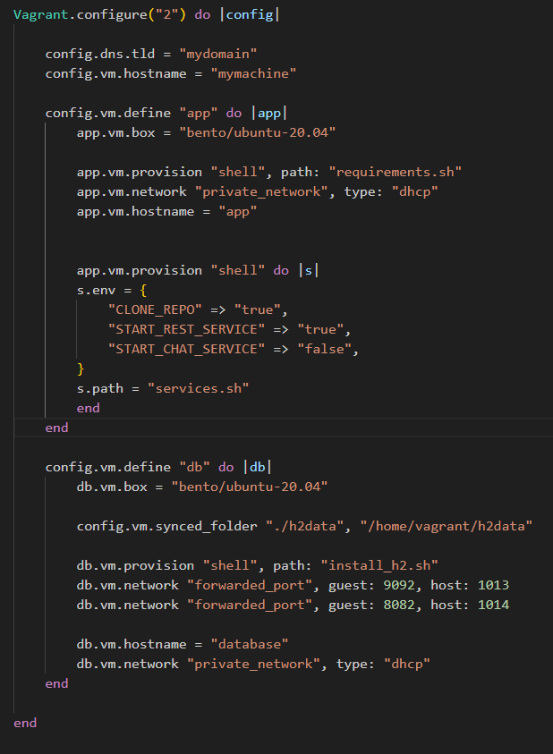

# CA3

## Part 2

### One VM should host the Spring application (app), while the other should host the H2 database (db)

For this step, first of all, we just split the vagrant file for two vms in vagrant file.

//To continue

### Ensure that your VMs are allocated sufficient resources

To configure the CPU and memory we can use the following configurations in the vagrant file

The name of the machine is "db", in this case.

We defined it to have 1024MB (1GB) of memory and 1 CPU.

To change the disk size we had to install a new plugin called "vagrant-disksize"

After the plugin was installed we used the following config:

    config.disksize.size = '5 GB'

After adding the configurations we destroyed and created the VM again with the following commands

    vagrant destroy
    vagrant up

### Secure the db VM by adding firewall rules to restrict access only to the app VM

We added the following commands to the install_h2.sh:

Allow SSH Access (Port 22)

    sudo ufw allow 22/tcp

This command opens port 22 for SSH connections, allowing remote access to the VM.
It makes sure we can connect to the VM for administration purposes.

Get the IP of app.mydomain

    ip_address=$(dig +short app.mydomain)

This line finds the current IP address for app.mydomain and stores it in a variable called ip_address.
By using this variable, the script can apply firewall rules to the right IP address, even if it changes.

Restrict Access to Port 9092

    sudo ufw allow from $ip_address to any port 9092

This command allows traffic on port 9092, but only from the IP address of app.mydomain.
It’s used to limit access to this port, so only app.mydomain can connect.

Enable the Firewall

    sudo ufw --force enable

This command turns on the firewall with the rules above.
It uses --force to skip any confirmation prompts.

### Alternative technological solution for the virtualization tool

The alternative chosen was Virtual box. Comparison between both tools

1. Purpose and Functionality

   - Vagrant: Vagrant is a tool for managing and deploying virtualized environments. It is designed to create, configure, and provision reproducible development environments. Vagrant focuses on the workflow of developers, allowing them to define the environment and automate the setup process using configuration files (Vagrantfile).

   - VirtualBox: VirtualBox is a free and open-source hypervisor that allows users to run multiple operating systems on a single physical machine. It provides the core virtualization technology, enabling the creation and management of virtual machines (VMs). VirtualBox is responsible for running the guest operating systems and handling hardware resources.

2. Virtualization Features

   - Resource Management:
     - Vagrant: Uses VirtualBox (or other providers) to manage VMs but does not directly handle hardware resources. Instead, it focuses on the configuration and automation of environments.
     - VirtualBox: Directly manages hardware resources and offers advanced features like snapshots, shared folders, and network configurations.

   - Provisioning:
     - Vagrant: Supports multiple provisioning tools (like Shell scripts, Ansible, Puppet, Chef) to automate the setup of the environment after a VM is created.
     - VirtualBox: Does not have built-in provisioning capabilities; users must set up the environment manually or script the provisioning externally.

   - Environment Reproducibility:
     - Vagrant: Allows developers to share a Vagrantfile that can recreate the same environment across different machines, promoting consistency and reducing "it works on my machine" issues.
     - VirtualBox: Can export and import VMs, but does not provide an easy way to define and share entire environments through a configuration file.

   - Multi-Provider Support:
     - Vagrant: Can work with various providers (like AWS, Docker, VMware, etc.), making it versatile for different use cases beyond just VirtualBox.
     - VirtualBox: Limited to its own environment and cannot integrate directly with other cloud services or platforms without additional configuration.

3. User Experience

   - Vagrant: Offers a command-line interface that simplifies the management of environments. Users can easily spin up or destroy environments with commands like vagrant up and vagrant destroy.

   - VirtualBox: Provides a graphical user interface (GUI) for managing VMs, which might be more user-friendly for those who prefer visual management but can be cumbersome for automated workflows.