# CA4

## Use Ansible as a provisioner

To start this part of the assignment, we had to define in the VagrantFile this provisioning:

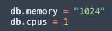

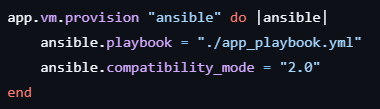

And remove these lines:

    app.vm.provision "shell", path: "requirements.sh"
    app.vm.provision "shell", path: "configure_spring.sh"

With this new configuration in the vagrantFile, now we are not using a shell script, but instead we are using ansible and a playbook to help us fulfill this assignment.
This changes were for the app VM and for the DB VM

Now showing the app_playbook that we created: 
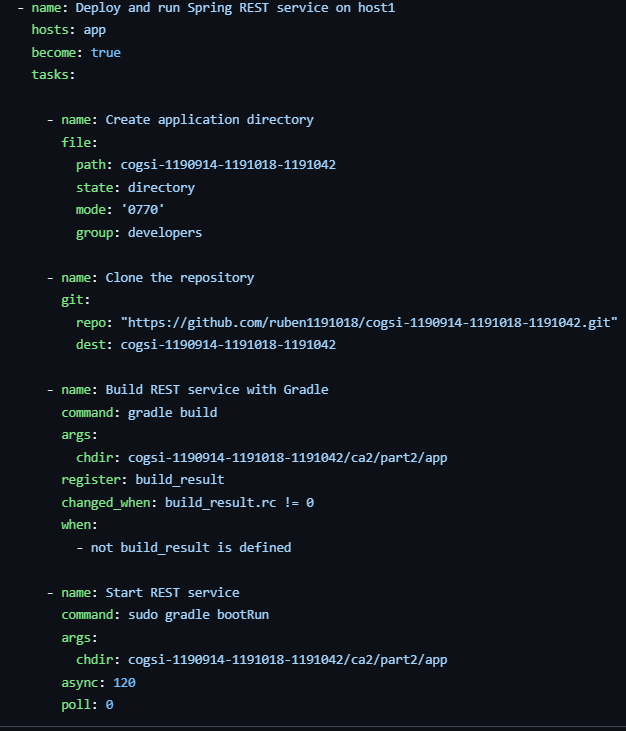

As we can see in this playbook, it is able to automate the deployment and 
execution of a Spring REST service on a specified host. It creates an 
application directory, clones the necessary Git repository, builds the 
service using Gradle, and then starts it in the background.

Now showing the db_playbook:

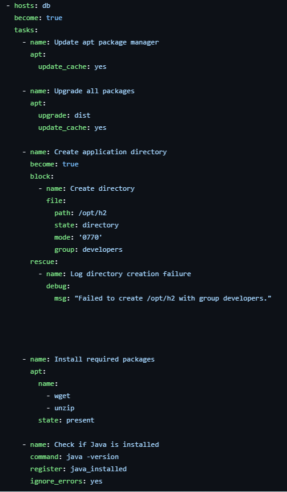
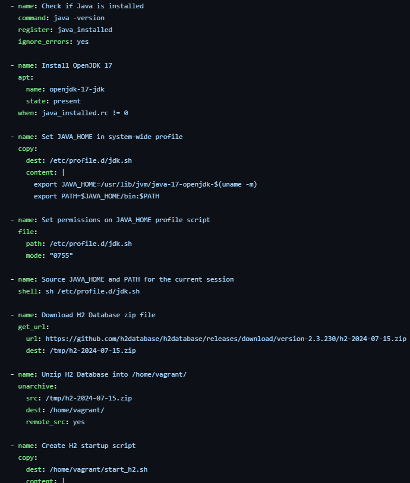
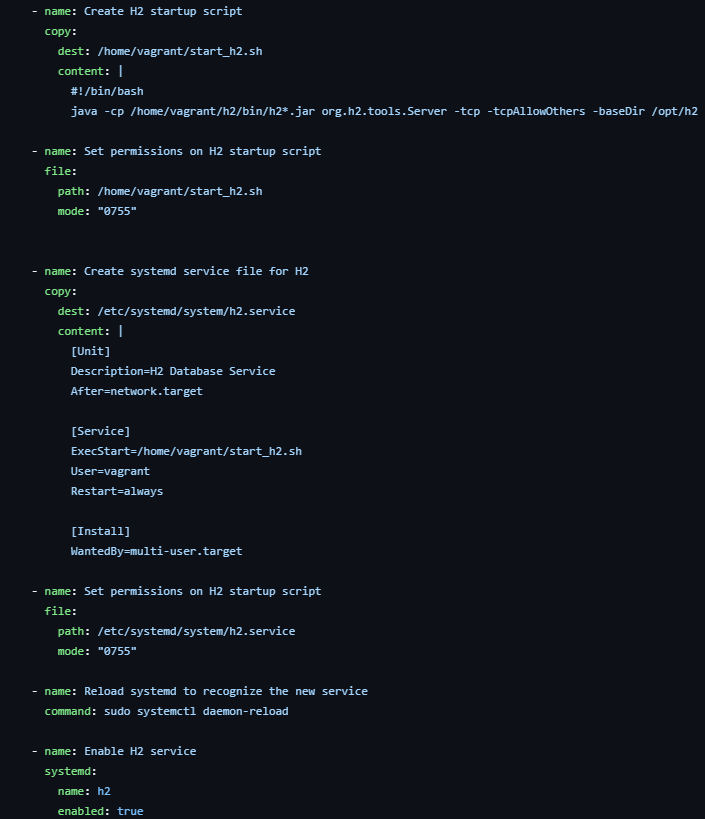
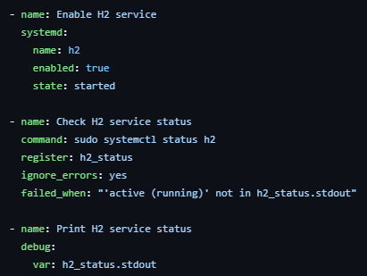

The main purpose of this playbook is to set up an H2 database on a host 
by updating packages, installing Java, and configuring H2. It creates 
necessary directories and scripts, sets up a systemd service for H2, and 
starts the service, ensuring it runs continuously.

The main purpose of this playbook is to set up an H2 database on a host
by updating packages, installing Java, and configuring H2. It creates
necessary directories and scripts, sets up a systemd service for H2, and
starts the service, ensuring it runs continuously.

Now explain some things about the playbook:

    - name: Update apt package manager
      apt:
        update_cache: yes
    
    - name: Upgrade all packages
      apt:
        upgrade: dist
        update_cache: yes

The apt module is Ansible’s package management tool for Debian-based systems like Ubuntu. The update_cache: yes
option updates the list of available packages, while upgrade: dist upgrades all installed packages to the latest
versions, ensuring the system is up-to-date.

    - name: Create application directory
      block:
        - name: Create directory
          file:
            path: /opt/h2
            state: directory
            mode: '0770'
            group: developers
      rescue:
        - name: Log directory creation failure
          debug:
            msg: "Failed to create /opt/h2 with group developers."

The file module manages files and directories. Here, it’s used to create the directory /opt/h2 if it doesn’t already exist.
- state: directory ensures the path exists as a directory.
- The rescue block with the debug module logs a failure message if the directory creation fails, providing helpful output for troubleshooting.

    - name: Check if Java is installed
      command: java -version
      register: java_installed
      ignore_errors: yes
    
    - name: Install OpenJDK 17
      apt:
        name: openjdk-17-jdk
        state: present
      when: java_installed.rc != 0

The command module runs the command java -version to check if Java is installed, storing the result in
java_installed. ignore_errors: yes allows the playbook to proceed even if Java isn’t found.
If Java isn’t installed (java_installed.rc != 0), the apt module installs openjdk-17-jdk.

    - name: Set JAVA_HOME in system-wide profile
      copy:
        dest: /etc/profile.d/jdk.sh
        content: |
          export JAVA_HOME=/usr/lib/jvm/java-17-openjdk-$(uname -m)
          export PATH=$JAVA_HOME/bin:$PATH

The copy module creates or updates a file with specific content. Here, it’s used to set the JAVA_HOME environment
variable in a profile script so it’s available to all users. This variable helps other programs locate the Java
installation.

    - name: Source JAVA_HOME and PATH for the current session
      shell: sh /etc/profile.d/jdk.sh

The shell module runs shell commands. Here, it sources the jdk.sh script so that JAVA_HOME and PATH are available
in the current session, allowing subsequent tasks to use Java.

    - name: Download H2 Database zip file
      get_url:
        url: https://github.com/h2database/h2database/releases/download/version-2.3.230/h2-2024-07-15.zip
        dest: /tmp/h2-2024-07-15.zip
    
    - name: Unzip H2 Database into /home/vagrant/
      unarchive:
        src: /tmp/h2-2024-07-15.zip
        dest: /home/vagrant/
        remote_src: yes

The get_url module downloads a file from the specified URL to a location on the host.
The unarchive module extracts the downloaded zip file into /home/vagrant/. remote_src: yes specifies that the file
is already on the remote machine, not on the local Ansible control node.

    - name: Enable H2 service
      systemd:
        name: h2
        enabled: true
        state: started

The systemd module enables and starts the H2 service, setting it to restart automatically if it stops.

    - name: Check H2 service status
      command: sudo systemctl status h2
      register: h2_status
      ignore_errors: yes
      failed_when: "'active (running)' not in h2_status.stdout"
    
    - name: Print H2 service status
      debug:
      var: h2_status.stdout

- The command module checks the status of the H2 service, storing the result in h2_status.
- failed_when ensures that the playbook reports a failure if the service isn’t running.
- The debug module prints the status output, aiding in troubleshooting.

## Use Ansible to configure PAM to enforce a complex password policy

In this task, our goal is to automate the process of enforcing a strong password policy for all users on the system using Ansible. By leveraging Ansible’s automation capabilities, we can ensure consistent application of security standards across all machines, reducing the risk of weak passwords and enhancing overall security.

To start, we configured the Vagrantfile to use Ansible for provisioning both virtual machines. The following configuration snippet enables Vagrant to run an Ansible playbook, common_playbook.yml, on both VMs. This setup ensures that the same password policies are applied across all instances automatically:

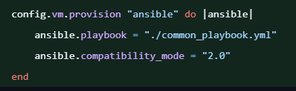

By specifying compatibility_mode as “2.0,” we maintain compatibility with Ansible's newer syntax and playbook requirements.

The playbook, common_playbook.yml, is designed to apply a complex password policy 
by configuring PAM (Pluggable Authentication Modules). PAM is a common framework for 
authentication in Linux systems, allowing us to enforce various password standards. 
This playbook applies to all hosts defined in the Ansible inventory and runs with 
elevated privileges (via become: true), as system-level configurations require root access.

      - name: Deploy and run Spring REST service on host1
        hosts: all
        become: true
        tasks:
            - name: Install libpam-pwquality
              package:
              name: "libpam-pwquality"
              state: present
            
            - name: Configure pam_pwquality
              lineinfile:
              path: "/etc/pam.d/common-password"
              regexp: "pam_pwquality.so"
              line: "password required pam_pwquality.so minlen=12 lcredit=-1 ucredit=-1 dcredit=-1 ocredit=-1 retry=3 enforce_for_root"
              state: present  

The first task(Install libpam-pwquality) in the playbook installs the libpam-pwquality
package, which is essential for enforcing password complexity rules in PAM. Without this
package, PAM lacks the functionality to impose specific rules on passwords, such as 
character requirements or minimum length.

The second task(Configure pam_pwquality) uses the lineinfile module to configure the 
password policy in the PAM configuration file located at /etc/pam.d/common-password. 
This configuration file manages password requirements for PAM, making it the appropriate
place to specify our password complexity rules.
Besides that, the second task does the following:

1. Checks for Existing Configuration: The regexp option searches for a line containing "pam_pwquality.so" within the configuration file. If found, Ansible replaces it with the new line defined in line.

2. Defines Complexity Rules: The line enforces specific password rules:
- minlen=12: Requires a minimum password length of 12 characters.
- lcredit=-1: Requires at least one lowercase letter.
- ucredit=-1: Requires at least one uppercase letter.
- dcredit=-1: Requires at least one digit.
- ocredit=-1: Requires at least one special character.
- retry=3: Allows users up to three attempts if they enter an invalid password.
- enforce_for_root: Enforces these rules for the root user as well, ensuring security standards are uniformly applied.

Each of these rules enhances password security by making it more difficult to 
guess or brute-force user passwords.

## Use Ansible to create a group called developers and a user devuser on the two VMs

In this configuration, the objective is to automate the creation of a user and group using Ansible, set a secure
password for that user, and control file access permissions on two virtual machines (VMs). Specifically, we will
be creating a group called developers, adding a user named devuser to this group, and restricting file access to
members of this group only.

This tasks that will be shown are from common_playbook

The group module in Ansible is used to manage system groups. Here, we specify the group name as developers and set its state to present, meaning the group will be created if it doesn’t already exist.

Next, we create the user devuser, who will be added to the developers group. This user will be granted access to the directories containing the application and database files.

The user module is used here to create the user devuser. We set the following parameters:
- name: Specifies the username, in this case, devuser.
- shell: Specifies the user’s login shell, here set to /bin/bash for a standard shell environment.
- password: Sets the user’s password using a known SHA-512 hash.

The password parameter accepts a precomputed SHA-512 password hash, allowing us to set a secure password
during provisioning. For this example, a hash has been provided
("$6$OStSJfA6FA$ffSDaJBWfSpmnwlC6QWJwLG3PgZWQhPYUSezmRvSiUFpwSWy/57KuUuLg/4yGBpKx2TWYsPDz9Yq7nL2I2XT3/"), which
meets the complexity requirements configured in PAM.

To generate the SHA-512 password hash on Ubuntu he had to this:

    sudo apt update
    sudo apt install pwgen whois
    pass=$(pwgen --secure --capitalize --numerals --symbols 12 1)
    echo $pass | mkpasswd --stdin --method=sha-512; echo $pass

- The third line of output will contain the SHA-512 hash, which you can use in Ansible’s password field.
- The fourth line shows the generated password itself, allowing you to securely note it if needed.

This approach ensures that the password meets the complexity enforced by PAM and provides a secure hash for Ansible to use without exposing the plaintext password.

After creating the user, we add devuser to the developers group. This step ensures that the user has access to the directories and files restricted to this group.

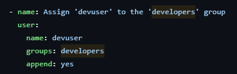

We use the user module again to modify the group memberships of devuser. The parameters are:
- groups: Specifies the group to which the user should be added, in this case, developers.
- append: Ensures that the user is added to this group without removing any existing group memberships.

To ensure that the developers group were the only ones with the authorization to access the directory asked in the assignment, it was needed to add this specification in the app_playbook and the db_playbook:

App:
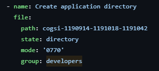

DB:
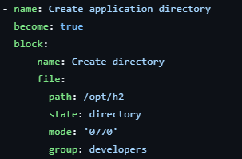

To ensure only the developers group has authorization to access certain directories, we modified existing tasks
in both the app_playbook and db_playbook to include the correct permissions and group ownership. Rather than
creating new tasks, we enhanced the current ones to align with the assignment's requirements.

We set the group for both to be developers. Besides that, we added the setting to mode 0770 to ensure
that only the owner and group(developers) have full read, write and execute access, while others are denied access.

## Ensure that playbooks are idempotent

Idempotency is a key concept in Ansible, meaning that playbooks can be run multiple times without causing unintended changes or side effects if the desired state is already achieved. To ensure idempotency and robust error handling, we made some changes in the Ansible playbooks.

Many Ansible modules are designed to be idempotent by default, meaning they check the current state before making any changes. 
Example: Creating a Directory

        - name: Create directory
          file: 
            path: /opt/h2
            state: directory
            mode: '0770'
            group: developers

The file module will check if the directory exists and matches the defined mode, group, and ownership before making any changes.

### Using ignore_erros

    - name: Check if Java is installed
      command: java -version
      register: java_installed
      ignore_errors: yes

ignore_errors: yes in a task can help ensure idempotency—the property where running a task multiple times produces the same result each time—by preventing errors from disrupting the rest of the playbook

Without ignore_errors: yes, if Java is not installed, Ansible will stop execution at this task due to the error
By using ignore_errors: yes, the playbook can continue running regardless of whether Java is installed

### Using failed_when

    - name: Check H2 service status
      command: sudo systemctl status h2
      register: h2_status
      ignore_errors: yes
      failed_when: "'active (running)' not in h2_status.stdout"

The failed_when condition allows to override Ansible’s default failure behavior. By default, the task would fail if systemctl status h2 returns a non-zero exit code, which happens if the H2 service is not running.
Instead, with failed_when: "'active (running)' not in h2_status.stdout", we're defining failure based on the absence of the phrase "active (running)" in the command’s output, rather than the command’s exit code.

### Using when

    - name: Check if Java is installed
      command: java -version
      register: java_installed
      ignore_errors: yes

    - name: Install OpenJDK 17
      apt:
        name: openjdk-17-jdk
        state: present
      when: java_installed.rc != 0

The second task, Install OpenJDK 17, is set to run only if Java is not installed. The when condition java_installed.rc != 0 checks the return code (rc) from the previous command:
        If Java is not installed, java -version will fail, and java_installed.rc will be non-zero (typically 1).
        If Java is installed, java -version succeeds, and java_installed.rc will be 0.
Therefore, apt: name=openjdk-17-jdk is only executed when java_installed.rc != 0, meaning Java is missing on the system.

Idempotency:

This approach ensures idempotency: the task to install OpenJDK 17 will only run if it is actually needed (i.e., when Java is missing). If Java is already present, the when condition prevents unnecessary installation, leaving the system unchanged.

### Alternative technological solution for the configuration management tool

The alternative chosen was Puppet. Comparison between both tools

1. Language and Approach
 - Ansible:
    * Uses YAML for its playbooks, which are easy to read and write.
    * Follows an agentless approach, using SSH for communication with managed nodes.
- Puppet:
    * Uses its own domain-specific language (DSL), which is more complex and has a steeper learning curve compared to YAML.
    * Operates with an agent-based architecture, where managed nodes run a Puppet agent that communicates with a central Puppet server (Puppet Master).

2. Configuration Management Features
- Ansible:

    * Provides ad-hoc task execution and configuration management.
    * Strong support for orchestration, allowing for detailed automation of multi-step processes.
    * Lacks an automatic rollback feature; tasks are typically idempotent but require explicit error handling for advanced rollbacks.

- Puppet:

    * Excels in enforcing desired state; once a configuration is applied, Puppet ensures the system maintains that state.
    * Comes with a built-in reporting and compliance feature, which helps in monitoring and auditing.
    * Offers robust versioning and configuration rollbacks, which can simplify handling complex environments.

3. Scalability and Performance
- Ansible:

    * Scalability can be achieved through external tools like Ansible Tower (AWX).
    * More lightweight due to its agentless nature but may face performance issues with complex tasks over a large number of nodes.
- Puppet:
    * Naturally more scalable due to its agent-server model, which supports thousands of nodes efficiently.
    * Can manage large-scale deployments with PuppetDB for tracking resources and configurations.
