## Version 1 : Build the server within the Dockerfile itself (clone the repo and build the server inside the container)

### Building Chat Version 1

This Dockerfile sets up a Docker image to compile and run a Spring Boot Java application using Gradle as the build tool. Here’s a breakdown of each part:

1. Choosing the Base Image

        # Use the OpenJDK 17 slim image
        FROM openjdk:17-jdk-slim

The base image selected is openjdk:17-jdk-slim, a lightweight version of OpenJDK 17. This image is minimal and includes only essential components to run Java applications, keeping the final image size smaller.

2. Installing Dependencies and Gradle

    # Install dependencies including wget, unzip, and git
    RUN apt-get update && \
    apt-get install -y wget unzip git && \
    wget https://services.gradle.org/distributions/gradle-7.6-bin.zip -P /tmp && \
    unzip -d /opt/gradle /tmp/gradle-7.6-bin.zip && \
    rm /tmp/gradle-7.6-bin.zip && \
    ln -s /opt/gradle/gradle-7.6/bin/gradle /usr/bin/gradle
    In this section, essential dependencies for the project are installed:

- apt-get update and apt-get install -y install wget, unzip, and git.
- wget downloads Gradle 7.6 as a .zip file.
- unzip extracts the Gradle archive to /opt/gradle.
- ln -s creates a symbolic link to the Gradle executable at /usr/bin/gradle, making it accessible system-wide as gradle.

3. Setting Environment Variables for Gradle

    # Set environment variables for Gradle
    ENV GRADLE_HOME /opt/gradle/gradle-7.6
    ENV PATH ${GRADLE_HOME}/bin:$PATH
    These environment variables set up the Gradle path, making it easy to access from anywhere within the environment. GRADLE_HOME points to the Gradle directory, while PATH is updated to include the Gradle binary.

4. Cloning the Repository

    # Clone the repository
    RUN git clone https://github.com/ruben1191018/cogsi-1190914-1191018-1191042.git /app

This line uses git to clone the project repository directly into the /app directory. This repository contains the source code that will be built and run.

5. Setting the Working Directory

    #Set the working directory to the project folder
    WORKDIR /app/ca2/part1/gradle_basic_demo-main

This sets the working directory of the container to /app/ca2/part1/gradle_basic_demo-main, where the project files are located.

6. Building the Project with Gradle

    # Build the project with Gradle
    RUN gradle build

This command compiles the project using Gradle, generating the required files (such as the application’s .jar file) within the build/libs directory.

7. Exposing the Port

    # Expose the port the Spring Boot app runs on
    EXPOSE 59001

This tells Docker that the application will use port 59001, enabling access to the service on this port when the container is running.

8. Starting the Application

    
    # Run the application
    ENTRYPOINT ["java", "-cp", "build/libs/basic_demo-0.1.0.jar", "basic_demo.ChatServerApp", "59001"]

This defines the command to start the application. Specifically, it uses java to run the .jar file generated during the build process (basic_demo-0.1.0.jar) with the main class basic_demo.ChatServerApp and specifies port 59001 for the chat server.

## Explore the concept of multi-stage builds to reduce the image size

We can split the image into two stages: 

- Build stage: This stage installs all necessary dependencies to build the application.

        # Stage 1: Build stage
        FROM openjdk:17-jdk-slim as build
        
        # Install build dependencies
        RUN apt-get update && \
        apt-get install -y wget unzip git && \
        wget https://services.gradle.org/distributions/gradle-7.6-bin.zip -P /tmp && \
        unzip -d /opt/gradle /tmp/gradle-7.6-bin.zip && \
        rm /tmp/gradle-7.6-bin.zip && \
        ln -s /opt/gradle/gradle-7.6/bin/gradle /usr/bin/gradle
        
        # Set environment variables for Gradle
        ENV GRADLE_HOME /opt/gradle/gradle-7.6
        ENV PATH ${GRADLE_HOME}/bin:$PATH
        
        # Clone the repository
        RUN git clone https://github.com/ruben1191018/cogsi-1190914-1191018-1191042.git /app
        
        # Set the working directory to the project folder
        WORKDIR /app/ca2/part1/gradle_basic_demo-main
        
        # Build the project with Gradle
        RUN gradle build

- Runtime stage: This stage will use a lighter JRE image (without the build tools) to run the application. Only copies the JAR file and necessary runtime files, making it smaller.

        # Stage 2: Runtime stage
        FROM openjdk:17-jdk-slim
        
        # Copy the built JAR file from the build stage
        COPY --from=build /app/ca2/part1/gradle_basic_demo-main/build/libs/basic_demo-0.1.0.jar /app/app.jar
        
        # Expose the port the Spring Boot app runs on
        EXPOSE 59001
        
        # Run the application
        ENTRYPOINT ["java", "-cp", "/app/app.jar", "basic_demo.ChatServerApp", "59001"]

File Copying:

- Instead of cloning and building in the final image, we copy only the necessary JAR file from the build stage.

Reduced Image Size:

- The final image now only contains the JRE and the application JAR, reducing the image size significantly.

To build the image we used the following commands

    docker build -t demo-image:latest
    
We tagged the image with the name demo-image:latest, and to run the image used the following command:

    docker run -d --name demo-run -p 59001:59001 demo-image:latest

The name specifies the name of the run, the -p publishes the port se we can access it from the outside and then we write the name of the image we want to run (created with the previous command)

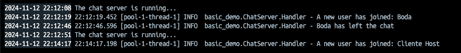

As we can see, the application is running in the docker and receiving connections from the host machine.

## Version 2: Build the server on your host machine and copy the resulting JAR file into the Docker image

### Building Rest Version 2

First, we ran the gradle build command to compile the project and create the JAR file.
After that, we verified that the JAR was generated.
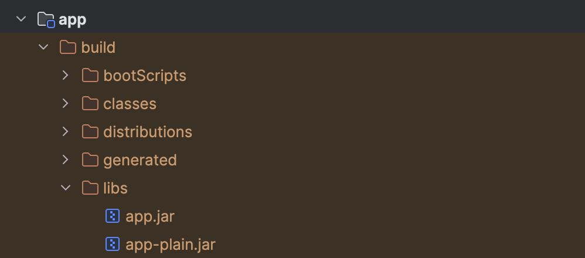

Next, we created a custom Dockerfile, named "Dockerfile_version2", with the following configurations:

    FROM openjdk:17-jdk-slim

    WORKDIR /app

    COPY app/build/libs/app.jar /app/my-server.jar

    ENTRYPOINT ["java", "-jar", "/app/my-server.jar"]

* FROM openjdk:17-jdk-slim:
This line specifies the base image for the container. We use openjdk:17-jdk-slim, a lightweight Java Development Kit image that includes the minimum necessary packages to run Java applications. This keeps the container size small and efficient.

* WORKDIR /app:
    This sets the working directory inside the container to /app. All subsequent COPY, RUN, CMD, and other instructions will use this directory as their base path, making it easy to manage files and operations within the container.

* COPY app/build/libs/app.jar /app/my-server.jar:
This instruction copies the JAR file (app.jar) from the app/build/libs/ directory on the host machine into the /app directory in the container and renames it to my-server.jar. This is necessary to include the application code that will be executed when the container runs.

* ENTRYPOINT ["java", "-jar", "/app/my-server.jar"]:
 This sets the command that the container runs when it starts. The ENTRYPOINT instruction runs the Java runtime and executes the my-server.jar file, launching the application. Using ENTRYPOINT ensures the specified command is always executed, making the container behavior predictable.

After creating this Dockerfile, we built the image using:

    docker build -f Dockerfile_version2 -t rest-app-image-version2 .

In this command, we specified the docker file name and tag the image with the name rest-app-image-version2.

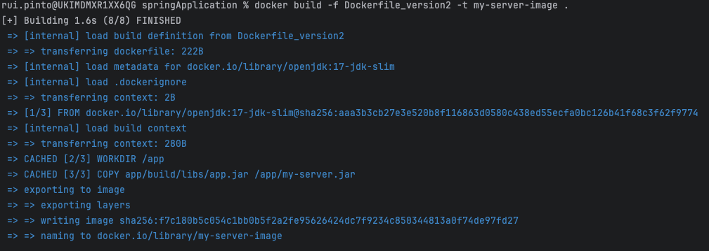

To run the application:

    docker run -p 8080:8080 rest-app-image-version2  

The docker run command starts a new container from the rest-app-image-version2 Docker image.
The -p 8080:8080 flag ensures that any requests to localhost:8080 on the host are forwarded to port 8080 in the container where the Java application is listening.

After this, we tested that the application was running:
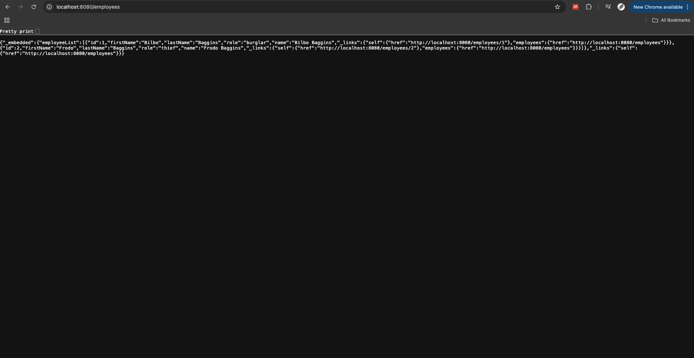

### Building Chat Version 2

First, we ran the gradle build command to compile the project and create the JAR file.
After that, we verified that the JAR was generated.
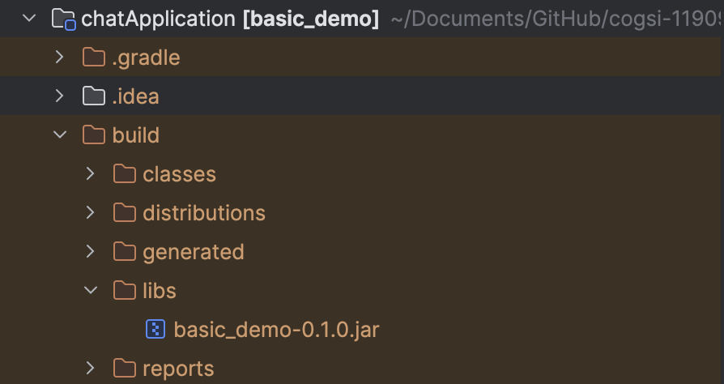

Next, we created a custom Dockerfile, named "Dockerfile_version2", with the following configurations:

    FROM openjdk:17-jdk-slim

    WORKDIR /app

    COPY build/libs/basic_demo-0.1.0.jar /app/my-server.jar

    ENTRYPOINT ["java", "-cp", "/app/my-server.jar", "basic_demo.ChatServerApp", "59001"]

* FROM openjdk:17-jdk-slim:
This line specifies the base image for the container. We use openjdk:17-jdk-slim, a lightweight Java Development Kit image that includes the minimum necessary packages to run Java applications. This keeps the container size small and efficient.

* WORKDIR /app:
    This sets the working directory inside the container to /app. All subsequent COPY, RUN, CMD, and other instructions will use this directory as their base path, making it easy to manage files and operations within the container.

* COPY build/libs/basic_demo-0.1.0.jar /app/my-server.jar
This instruction copies the JAR file from the build/libs/basic_demo-0.1.0.jar directory on the host machine into the /app directory in the container and renames it to my-server.jar. This is necessary to include the application code that will be executed when the container runs.

* ENTRYPOINT ["java", "-cp", "/app/my-server.jar", "basic_demo.ChatServerApp", "59001"]:
This sets the command that is executed when the container starts. Here, java is run with the -cp (classpath) option, which specifies my-server.jar as the classpath. The main class basic_demo.ChatServerApp is the entry point for the application, and 59001 is an argument passed to it (the port the server listens on).

After creating this Dockerfile, we built the image using:

    docker build -f Dockerfile_version2 -t chat-app-image-version2 .

In this command, we specified the docker file name and tag the image with the chat-app-image-version2.

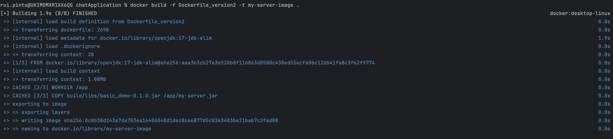

To run the application:

    docker run -p 59001:59001 chat-app-image-version2

The docker run command starts a new container from the chat-app-image-version2 Docker image.
The -p 59001:59001 flag ensures that any requests to localhost:8080 on the host are forwarded to port 8080 in the container where the Java application is listening.

After this, we tested that the application was running:
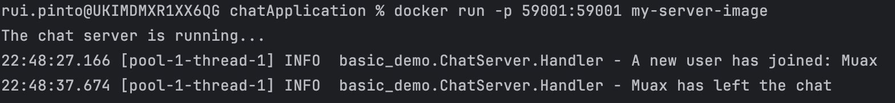

### Display the history of each image, showing each layer and command used to create the image Version 2

To display the history of each image we ran:

    docker history rest-app-image-version2

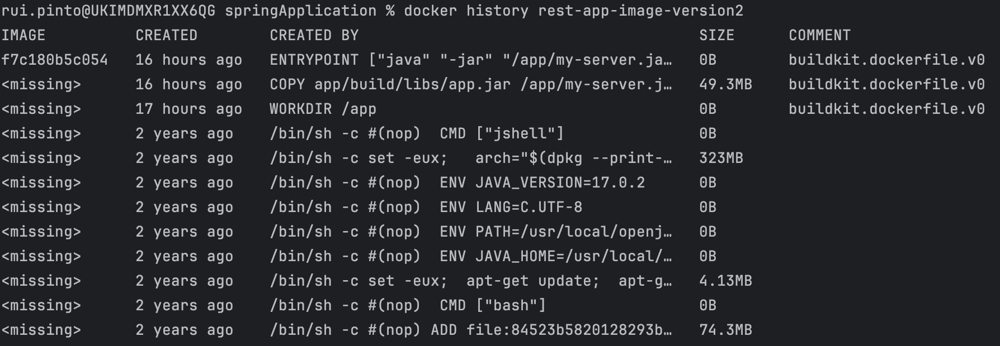

    docker history chat-app-image-version2

### Monitor container resource consumption in real-time Version 2

In order to monitor both containers we ran the docker status command where we can see the following properties:

* CPU %: Percentage of CPU usage.
* MEM USAGE / LIMIT: Amount of memory used vs. total available memory for the container.
* MEM %: Percentage of memory used relative to the available memory.
* NET I/O: Network I/O stats (data sent/received).
* BLOCK I/O: Block I/O stats (disk read/write).
* PIDS: Number of processes running inside the container.

So we ran 

    docker stats REST_APP_V2

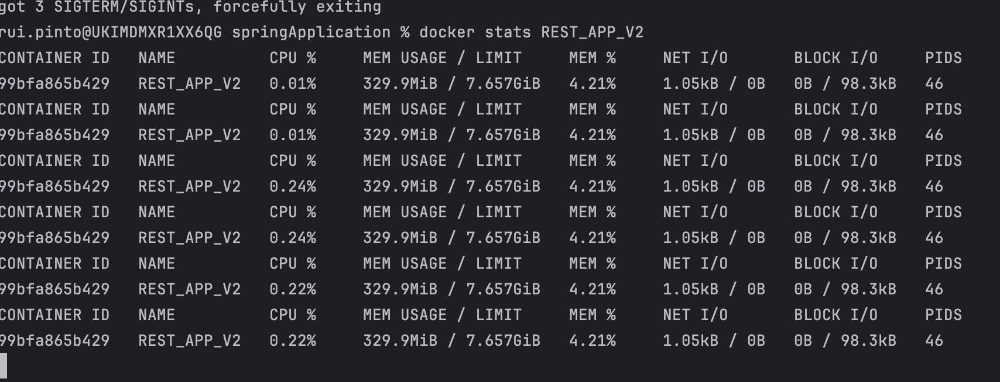

and 

    docker stats CHAT_APP_V2

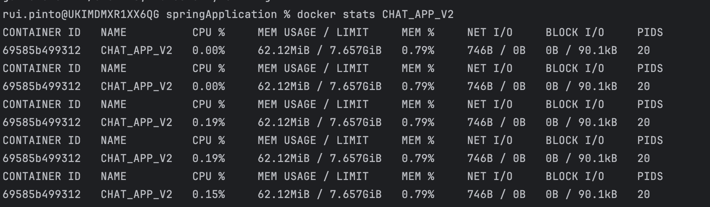

### You should tag your images and publish them in Docker Hub version 2

To deploy Docker images to Docker Hub, we followed a sequence of steps that involved logging in, tagging the images, and pushing them to the repository. Below is a detailed breakdown of each step and its purpose.

#### Log in to Docker Hub
First, we authenticated to Docker Hub by running the following command:

    docker login

This command prompts the user to enter their Docker Hub credentials (username and password) to establish a session with Docker Hub. Logging in is a necessary step to gain authorization for pushing images to our Docker Hub repositories.

#### Tagging the Images

Next, we assigned tags to each image. Tagging associates each local image with a specific repository and tag format that Docker Hub recognizes. We used the following commands:

    docker tag rest-app-image-version2 1191018/cogsi-rest-v2:latest
    docker tag chat-app-image-version2 1191018/cogsi-chat-v2:latest

* docker tag: This command is used to label an existing local Docker image with a new name and tag.
* rest-app-image-version2 and chat-app-image-version2: These are the original names of the local images we created or built.
* 1191018/cogsi-rest-v2:latest and 1191018/cogsi-chat-v2:latest: These are the new names and tags assigned to each image. The format here is username/repository:tag.
    * 1191018: Represents our Docker Hub username.
    * cogsi-rest-v2 and cogsi-chat-v2: Specify the unique repository names for each image.
    * latest: The chosen tag for this version of each image. The latest tag is commonly used to represent the most recent stable version.

#### Pushing the Images to Docker Hub
Finally, we pushed each tagged image to Docker Hub using the following commands:

    docker push 1191018/cogsi-rest-v2:latest
    docker push 1191018/cogsi-chat-v2:latest

* docker push: This command uploads the tagged images from the local system to the specified Docker Hub repositories.

* 1191018/cogsi-rest-v2:latest and 1191018/cogsi-chat-v2:latest: These refer to the fully qualified names of each image on Docker Hub, as specified during the tagging step.

Once pushed, the images are available in our Docker Hub account under the specified repositories and can be pulled and used by others if permissions allow.

This structured approach ensures that each image is correctly tagged and stored in a centralized Docker Hub repository, making it accessible for deployment and collaboration.

In the docker hub we have the following repositories for the different images: 

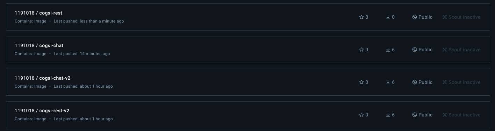

Inside each repository we can see the images pushed before:

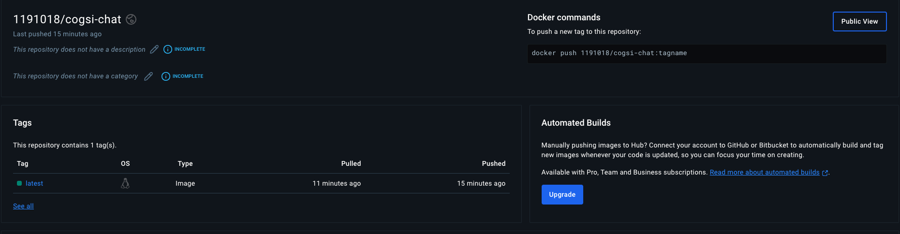
