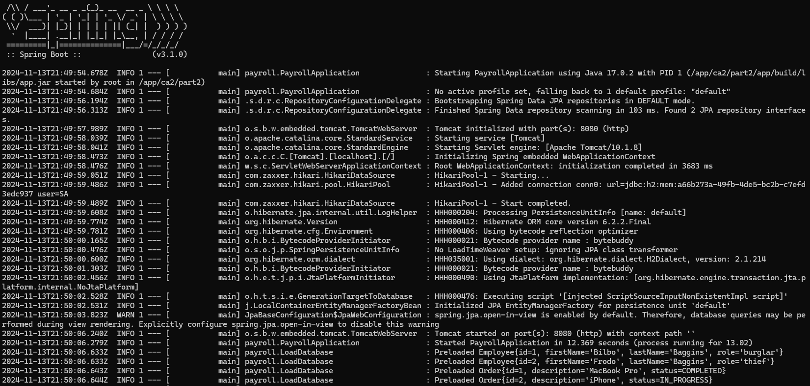

# Part 1

## Version 1 : Build the server within the Dockerfile itself (clone the repo and build the server inside the container)

### Building Chat Version 1

This Dockerfile sets up a Docker image to compile and run a Spring Boot Java application using Gradle as the build tool. Here’s a breakdown of each part:

1. Choosing the Base Image

        # Use the OpenJDK 17 slim image
        FROM openjdk:17-jdk-slim

The base image selected is openjdk:17-jdk-slim, a lightweight version of OpenJDK 17. This image is minimal and includes only essential components to run Java applications, keeping the final image size smaller.

2. Installing Dependencies and Gradle

    # Install dependencies including wget, unzip, and git
    RUN apt-get update && \
    apt-get install -y wget unzip git && \
    wget https://services.gradle.org/distributions/gradle-7.6-bin.zip -P /tmp && \
    unzip -d /opt/gradle /tmp/gradle-7.6-bin.zip && \
    rm /tmp/gradle-7.6-bin.zip && \
    ln -s /opt/gradle/gradle-7.6/bin/gradle /usr/bin/gradle
    In this section, essential dependencies for the project are installed:

- apt-get update and apt-get install -y install wget, unzip, and git.
- wget downloads Gradle 7.6 as a .zip file.
- unzip extracts the Gradle archive to /opt/gradle.
- ln -s creates a symbolic link to the Gradle executable at /usr/bin/gradle, making it accessible system-wide as gradle.

3. Setting Environment Variables for Gradle

    # Set environment variables for Gradle
    ENV GRADLE_HOME /opt/gradle/gradle-7.6
    ENV PATH ${GRADLE_HOME}/bin:$PATH
    These environment variables set up the Gradle path, making it easy to access from anywhere within the environment. GRADLE_HOME points to the Gradle directory, while PATH is updated to include the Gradle binary.

4. Cloning the Repository

    # Clone the repository
    RUN git clone https://github.com/ruben1191018/cogsi-1190914-1191018-1191042.git /app

This line uses git to clone the project repository directly into the /app directory. This repository contains the source code that will be built and run.

5. Setting the Working Directory

    #Set the working directory to the project folder
    WORKDIR /app/ca2/part1/gradle_basic_demo-main

This sets the working directory of the container to /app/ca2/part1/gradle_basic_demo-main, where the project files are located.

6. Building the Project with Gradle

    # Build the project with Gradle
    RUN gradle build

This command compiles the project using Gradle, generating the required files (such as the application’s .jar file) within the build/libs directory.

7. Exposing the Port

    # Expose the port the Spring Boot app runs on
    EXPOSE 59001

This tells Docker that the application will use port 59001, enabling access to the service on this port when the container is running.

8. Starting the Application

    
    # Run the application
    ENTRYPOINT ["java", "-cp", "build/libs/basic_demo-0.1.0.jar", "basic_demo.ChatServerApp", "59001"]

This defines the command to start the application. Specifically, it uses java to run the .jar file generated during the build process (basic_demo-0.1.0.jar) with the main class basic_demo.ChatServerApp and specifies port 59001 for the chat server.

To build the image we used the following commands

    docker build -t demo-image:latest

We tagged the image with the name demo-image:latest, and to run the image used the following command:

    docker run -d --name demo-run -p 59001:59001 demo-image:latest

The name specifies the name of the run, the -p publishes the port se we can access it from the outside and then we write the name of the image we want to run (created with the previous command)

As we can see, the application is running in the docker and receiving connections from the host machine.

### Building Rest Services Version 1

First of all, I started by creating the Dockerfile inside the folder of the spring application.

    # Use an official OpenJDK 17 image as the base image
    FROM openjdk:17-jdk-slim
    
    # Install dependencies including wget, unzip, and git
    RUN apt-get update && \
    apt-get install -y wget unzip git && \
    wget https://services.gradle.org/distributions/gradle-7.6-bin.zip -P /tmp && \
    unzip -d /opt/gradle /tmp/gradle-7.6-bin.zip && \
    rm /tmp/gradle-7.6-bin.zip && \
    ln -s /opt/gradle/gradle-7.6/bin/gradle /usr/bin/gradle
    
    # Set environment variables for Gradle
    ENV GRADLE_HOME /opt/gradle/gradle-7.6
    ENV PATH ${GRADLE_HOME}/bin:$PATH

    # Clone the repository
    RUN git clone https://github.com/ruben1191018/cogsi-1190914-1191018-1191042.git /app
    
    #Set the working directory to the project folder
    WORKDIR /app/ca2/part2
    
    # Run the Gradle build to generate the application JAR
    RUN gradle build
    
    # Expose the port the Spring Boot app runs on
    EXPOSE 8080
    
    # Run the application
    ENTRYPOINT ["java", "-jar", "app/build/libs/app.jar"]

About the dockerfile, the logic is really similar to the chat application, that was already explained previously.

To build the image we used the following commands:

    docker build -t spring_application_image .

We tagged the image with the name demo-image:latest, and to run the image used the following command:

    docker run -d --name spring_application_run -p 8080:8080 spring_application_image

The name specifies the name of the run, the -p publishes the port se we can access it from the outside and then we write the name of the image we want to run (created with the previous command)

As we can see, the application is running in the docker and receiving connections from the host machine.

## Explore the concept of multi-stage builds to reduce the image size

We can split the image into two stages: 

- Build stage: This stage installs all necessary dependencies to build the application.

    - Chat application

          # Stage 1: Build stage
          FROM openjdk:17-jdk-slim as build
        
          # Install build dependencies
          RUN apt-get update && \
          apt-get install -y wget unzip git && \
          wget https://services.gradle.org/distributions/gradle-7.6-bin.zip -P /tmp && \
          unzip -d /opt/gradle /tmp/gradle-7.6-bin.zip && \
          rm /tmp/gradle-7.6-bin.zip && \
          ln -s /opt/gradle/gradle-7.6/bin/gradle /usr/bin/gradle
        
          # Set environment variables for Gradle
          ENV GRADLE_HOME /opt/gradle/gradle-7.6
          ENV PATH ${GRADLE_HOME}/bin:$PATH
        
          # Clone the repository
          RUN git clone https://github.com/ruben1191018/cogsi-1190914-1191018-1191042.git /app
        
          # Set the working directory to the project folder
          WORKDIR /app/ca2/part1/gradle_basic_demo-main
        
          # Build the project with Gradle
          RUN gradle build

    - Rest Services application
      
           # Stage 1: Build stage
          FROM openjdk:17-jdk-slim
        
          # Install build dependencies
          RUN apt-get update && \
          apt-get install -y wget unzip git && \
          wget https://services.gradle.org/distributions/gradle-7.6-bin.zip -P /tmp && \
          unzip -d /opt/gradle /tmp/gradle-7.6-bin.zip && \
          rm /tmp/gradle-7.6-bin.zip && \
          ln -s /opt/gradle/gradle-7.6/bin/gradle /usr/bin/gradle
        
          # Set environment variables for Gradle
          ENV GRADLE_HOME /opt/gradle/gradle-7.6
          ENV PATH ${GRADLE_HOME}/bin:$PATH
        
          # Clone the repository
          RUN git clone https://github.com/ruben1191018/cogsi-1190914-1191018-1191042.git /app
        
          # Set the working directory to the project folder
          WORKDIR /app/ca2/part2
        
          # Build the project with Gradle
          RUN gradle build

- Runtime stage: This stage will use a lighter JRE image (without the build tools) to run the application. Only copies the JAR file and necessary runtime files, making it smaller.

  - Chat application

          # Stage 2: Runtime stage
          FROM openjdk:17-jdk-slim
        
          # Copy the built JAR file from the build stage
          COPY --from=build /app/ca2/part1/gradle_basic_demo-main/build/libs/basic_demo-0.1.0.jar /app/app.jar
        
          # Expose the port the Spring Boot app runs on
          EXPOSE 59001
        
          # Run the application
          ENTRYPOINT ["java", "-cp", "/app/app.jar", "basic_demo.ChatServerApp", "59001"]

  - Rest Services application

        # Stage 2: Runtime stage
        FROM openjdk:17-jdk-slim
    
        # Copy the built JAR file from the build stage
        COPY --from=build /app/ca2/part2/build/libs/app.jar      /app/app.jar
    
        # Expose the port the Spring Boot app runs on
        EXPOSE 8080
    
        # Run the application
        ENTRYPOINT ["java", "-jar", "app/build/libs/app.jar"]

File Copying:

- Instead of cloning and building in the final image, we copy only the necessary JAR file from the build stage.

Reduced Image Size:

- The final image now only contains the JRE and the application JAR, reducing the image size significantly.

## Version 2: Build the server on your host machine and copy the resulting JAR file into the Docker image

### Building Rest Version 2

First, we ran the gradle build command to compile the project and create the JAR file.
After that, we verified that the JAR was generated.

Next, we created a custom Dockerfile, named "Dockerfile_version2", with the following configurations:

    FROM openjdk:17-jdk-slim

    WORKDIR /app

    COPY app/build/libs/app.jar /app/my-server.jar

    ENTRYPOINT ["java", "-jar", "/app/my-server.jar"]

* FROM openjdk:17-jdk-slim:
This line specifies the base image for the container. We use openjdk:17-jdk-slim, a lightweight Java Development Kit image that includes the minimum necessary packages to run Java applications. This keeps the container size small and efficient.

* WORKDIR /app:
    This sets the working directory inside the container to /app. All subsequent COPY, RUN, CMD, and other instructions will use this directory as their base path, making it easy to manage files and operations within the container.

* COPY app/build/libs/app.jar /app/my-server.jar:
This instruction copies the JAR file (app.jar) from the app/build/libs/ directory on the host machine into the /app directory in the container and renames it to my-server.jar. This is necessary to include the application code that will be executed when the container runs.

* ENTRYPOINT ["java", "-jar", "/app/my-server.jar"]:
 This sets the command that the container runs when it starts. The ENTRYPOINT instruction runs the Java runtime and executes the my-server.jar file, launching the application. Using ENTRYPOINT ensures the specified command is always executed, making the container behavior predictable.

After creating this Dockerfile, we built the image using:

    docker build -f Dockerfile_version2 -t rest-app-image-version2 .

In this command, we specified the docker file name and tag the image with the name rest-app-image-version2.

To run the application:

    docker run -p 8080:8080 rest-app-image-version2  

The docker run command starts a new container from the rest-app-image-version2 Docker image.
The -p 8080:8080 flag ensures that any requests to localhost:8080 on the host are forwarded to port 8080 in the container where the Java application is listening.

After this, we tested that the application was running:

### Building Chat Version 2

First, we ran the gradle build command to compile the project and create the JAR file.
After that, we verified that the JAR was generated.

Next, we created a custom Dockerfile, named "Dockerfile_version2", with the following configurations:

    FROM openjdk:17-jdk-slim

    WORKDIR /app

    COPY build/libs/basic_demo-0.1.0.jar /app/my-server.jar

    ENTRYPOINT ["java", "-cp", "/app/my-server.jar", "basic_demo.ChatServerApp", "59001"]

* FROM openjdk:17-jdk-slim:
This line specifies the base image for the container. We use openjdk:17-jdk-slim, a lightweight Java Development Kit image that includes the minimum necessary packages to run Java applications. This keeps the container size small and efficient.

* WORKDIR /app:
    This sets the working directory inside the container to /app. All subsequent COPY, RUN, CMD, and other instructions will use this directory as their base path, making it easy to manage files and operations within the container.

* COPY build/libs/basic_demo-0.1.0.jar /app/my-server.jar
This instruction copies the JAR file from the build/libs/basic_demo-0.1.0.jar directory on the host machine into the /app directory in the container and renames it to my-server.jar. This is necessary to include the application code that will be executed when the container runs.

* ENTRYPOINT ["java", "-cp", "/app/my-server.jar", "basic_demo.ChatServerApp", "59001"]:
This sets the command that is executed when the container starts. Here, java is run with the -cp (classpath) option, which specifies my-server.jar as the classpath. The main class basic_demo.ChatServerApp is the entry point for the application, and 59001 is an argument passed to it (the port the server listens on).

After creating this Dockerfile, we built the image using:

    docker build -f Dockerfile_version2 -t chat-app-image-version2 .

In this command, we specified the docker file name and tag the image with the chat-app-image-version2.

To run the application:

    docker run -p 59001:59001 chat-app-image-version2

The docker run command starts a new container from the chat-app-image-version2 Docker image.
The -p 59001:59001 flag ensures that any requests to localhost:8080 on the host are forwarded to port 8080 in the container where the Java application is listening.

After this, we tested that the application was running:

### Display the history of each image, showing each layer and command used to create the image Version 2

To display the history of each image we ran:

    docker history rest-app-image-version2

    docker history chat-app-image-version2

    docker history spring_application_image

### Monitor container resource consumption in real-time Version 2

In order to monitor both containers we ran the docker status command where we can see the following properties:

* CPU %: Percentage of CPU usage.
* MEM USAGE / LIMIT: Amount of memory used vs. total available memory for the container.
* MEM %: Percentage of memory used relative to the available memory.
* NET I/O: Network I/O stats (data sent/received).
* BLOCK I/O: Block I/O stats (disk read/write).
* PIDS: Number of processes running inside the container.

So we ran 

    docker stats REST_APP_V2

and 

    docker stats CHAT_APP_V2

and

    docker stats spring_application_run

    

### You should tag your images and publish them in Docker Hub version 2

To deploy Docker images to Docker Hub, we followed a sequence of steps that involved logging in, tagging the images, and pushing them to the repository. Below is a detailed breakdown of each step and its purpose.

#### Log in to Docker Hub
First, we authenticated to Docker Hub by running the following command:

    docker login

This command prompts the user to enter their Docker Hub credentials (username and password) to establish a session with Docker Hub. Logging in is a necessary step to gain authorization for pushing images to our Docker Hub repositories.

#### Tagging the Images

Next, we assigned tags to each image. Tagging associates each local image with a specific repository and tag format that Docker Hub recognizes. We used the following commands:

    docker tag rest-app-image-version2 1191018/cogsi-rest-v2:latest
    docker tag chat-app-image-version2 1191018/cogsi-chat-v2:latest
    docker tag spring_application_image 1191018/cogsi-rest:latest

* docker tag: This command is used to label an existing local Docker image with a new name and tag.
* rest-app-image-version2 and chat-app-image-version2: These are the original names of the local images we created or built.
* 1191018/cogsi-rest-v2:latest, 1191018/cogsi-chat-v2:latest and 1191018/cogsi-rest:latest: These are the new names and tags assigned to each image. The format here is username/repository:tag.
    * 1191018: Represents our Docker Hub username.
    * cogsi-rest-v2,cogsi-chat-v2 and cogsi-rest: Specify the unique repository names for each image.
    * latest: The chosen tag for this version of each image. The latest tag is commonly used to represent the most recent stable version.

#### Pushing the Images to Docker Hub
Finally, we pushed each tagged image to Docker Hub using the following commands:

    docker push 1191018/cogsi-rest-v2:latest
    docker push 1191018/cogsi-chat-v2:latest
    docker push 1191018/cogsi-rest:latest

* docker push: This command uploads the tagged images from the local system to the specified Docker Hub repositories.

* 1191018/cogsi-rest-v2:latest, 1191018/cogsi-chat-v2:latest and 1191018/cogsi-rest:latest: These refer to the fully qualified names of each image on Docker Hub, as specified during the tagging step.

Once pushed, the images are available in our Docker Hub account under the specified repositories and can be pulled and used by others if permissions allow.

This structured approach ensures that each image is correctly tagged and stored in a centralized Docker Hub repository, making it accessible for deployment and collaboration.

In the docker hub we have the following repositories for the different images: 

Inside each repository we can see the images pushed before:

# Part 2

On this section, we will provide a comprehensive guide to the Docker Compose configuration for
deploying the Building REST Services with Spring application alongside an H2 database. 
The setup includes a custom network, persistent storage, and environment variable-based 
configuration to ensure seamless integration and scalability.

The Docker Compose setup orchestrates two services:

- Spring Application (app)
  - Hosts the Gradle-based RESTful service.

- H2 Database (h2-db)
  - Runs the H2 database in server mode with persistent storage.

## Docker compose configuration:

### Services

- app(Spring application)

  - Image: 1191018/cogsi-rest-v2:latest:

    A pre-built image of the Spring application, pushed to a Docker registry.
  
  - Container Name: cogsi_app
  
    Simplifies identification.

  - Ports:
  
    Maps 8080:8080 for application access via http://localhost:8080.
    
  - Environment Variables:
    

    SPRING_DATASOURCE_URL: Connects to the H2 database at jdbc:h2:tcp://h2:1521/~/test.
    SPRING_DATASOURCE_USERNAME: Default is sa.
    SPRING_DATASOURCE_PASSWORD: Default is empty.
    SPRING_DATASOURCE_DRIVERCLASSNAME: org.h2.Driver.
    SPRING_JPA_HIBERNATE_DDL_AUTO: Ensures schema creation during startup.
    
  - Dependencies:

    depends_on: Ensures h2-db starts before app.
    
  - Network:

    Connected to a custom bridge network (app-network).

- h2-db (H2 Database)

  - Image: 1000kit/h2
  
    Runs H2 in server mode.
    
  - Container Name: h2
    
  - Ports:
    - Maps 8181:8181 for the H2 web console (http://localhost:8181).
    - Maps 1521:1521 for database communication.
    
  - Volumes:
    
    h2-data:/opt/h2-data: Ensures persistent storage for database files.
     
    
    
    
  - Network:
  
    Connected to app-network.

### Volumes

- app-network:

    A custom bridge network enabling service communication via container names (e.g., h2).

### How to Use

#### Start the Services

    docker-compose up -d

Starts both services in detached mode.

#### Access the Services

Spring Application: http://localhost:8080
H2 Database Console: http://localhost:8181

#### Stop the Services

    docker-compose down

Stops and removes containers, networks, and volumes.

### Testing Network Connectivity

- Ping Test

  To do this test, we need to verify container connectivity using:

  
    docker run -it --network ca5_app-network busybox ping h2

  - This command creates and starts a new container based on busybox.
  - -it: This is a combination of two flags:
    - -i (Interactive): Keeps the container’s standard input (stdin) open, allowing the user to provide input to the container interactively.
    - -t (TTY): Allocates a pseudo-TTY (terminal) for the container, making it act like a typical command-line terminal.
  - --network ca5_app-network
    - --network: Specifies the network that the container should connect to.
    - ca5_app-network: The name of the Docker network to which the container is attached. This ensures the container can communicate with other containers connected to the same network.
  - busybox
    - This is the name of the Docker image used to create the container.
    - busybox is a minimal Linux distribution designed for small or lightweight tasks, including networking utilities like ping.
  - ping h2
    - It runs the ping command to check if the h2 service (the database container) is reachable within the network.

  

- Database Connection

  

As you can see in the image above, the application is connected to the DB and you can see in this line:

    2024-11-18T22:10:51.539Z  INFO 1 --- [           main] com.zaxxer.hikari.pool.HikariPool        : HikariPool-1 - Added connection conn0: url=jdbc:h2:tcp://h2:1521/./test user=SA

### Environment Variable Summary

| Variable                          | Description                               |
|-----------------------------------|-------------------------------------------|
| SPRING_DATASOURCE_URL             | 	JDBC URL for connecting to the database. |
| SPRING_DATASOURCE_USERNAME        | Database username (default: sa).          |
| SPRING_DATASOURCE_PASSWORD        | Database password (default: empty).       |
| SPRING_DATASOURCE_DRIVERCLASSNAME | 	Database driver (org.h2.Driver).         |
| SPRING_JPA_HIBERNATE_DDL_AUTO     | Hibernate schema creation mode.           |

### Persistence 

- Volume:

    Data is stored in h2-data, ensuring durability across container restarts or deletions.

### Block connections outside the containers
To block all the connections outside the specified containers we defined the property "internal"  to true.
By default, Compose provides external connectivity to networks. internal, when set to true, allows to create an externally isolated network.

### Conclusion

This Docker Compose setup simplifies the deployment of the Building REST Services with Spring 
application and the H2 database. With persistent storage, seamless networking, and straightforward
configuration, this setup provides a robust solution for development and testing environments.

## Alternative Technological Solution for Container Management

Podman (short for "Pod Manager") is a popular alternative to Docker for container management. Unlike Docker, Podman is daemonless and adheres to the concept of being a more secure and lightweight tool. It provides similar functionality to Docker, allowing users to build, run, and manage containers but without needing a background service (daemon) to run containers.

### Daemonless Architecture

* Podman: Operates without a central daemon, which increases security and allows containers to run as individual processes. Each container runs under the user's privileges, enhancing security by reducing the risk associated with root-level daemons.

* Docker: Relies on a central daemon that manages all containers. This architecture can be a single point of failure and requires root access, which poses potential security vulnerabilities.

### Rootless Containers

* Podman: Fully supports rootless containers, enabling non-root users to run and manage containers. This feature bolsters system security and is aligned with least-privilege principles.

* Docker: While Docker offers rootless mode, it was introduced later and may not be as seamlessly integrated or as robust as Podman's implementation.

### Pod Management

* Podman: Inspired by Kubernetes’ pod concept, Podman natively supports pods—groups of containers that share resources such as network and storage. This feature provides a smoother transition for users looking to scale container applications to Kubernetes.

* Docker: Primarily designed for single-container management. It can simulate pod-like behavior with Docker Compose, but it lacks native support for multi-container pod structures.

### Compatibility with Docker CLI

* Podman: Offers compatibility with Docker CLI commands through alias docker=podman, allowing users familiar with Docker to transition without extensive retraining.

* Docker: Naturally, the Docker CLI is native to Docker. The primary Docker commands are well-documented and widely adopted in container ecosystems.

### Systemd Integration

* Podman: Integrates seamlessly with systemd for managing container lifecycles, making it easier to define and control services. Containers can be launched and monitored directly as system services.
 
* Docker: Requires additional configuration to work with systemd for container lifecycle management, which can be less straightforward.

### Performance and Resource Utilization

* Podman: Tends to use fewer system resources since there’s no persistent daemon consuming memory and CPU. This efficiency can lead to better overall performance, especially on resource-constrained systems.

* Docker: The Docker daemon can introduce overhead, especially in environments where lightweight and efficient resource use is essential.

### Conclusion

Podman presents a robust, secure, and flexible alternative to Docker for container management. It excels in areas such as rootless operations, security, and direct integration with systemd, making it a strong candidate for developers and organizations prioritizing security and Kubernetes-native workflows. While Docker remains a highly adopted and user-friendly solution with a mature ecosystem, Podman's feature set and design choices provide distinct advantages that cater to modern container management needs.

## Alternative Implementation

### Part 1

#### PodmanFile Chat Application:

    FROM docker.io/library/openjdk:17-jdk-slim

    # Install Gradle
    RUN apt-get update && \
    apt-get install -y wget unzip git && \
    wget https://services.gradle.org/distributions/gradle-7.6-bin.zip -P /tmp && \
    unzip -d /opt/gradle /tmp/gradle-7.6-bin.zip && \
    rm /tmp/gradle-7.6-bin.zip && \
    ln -s /opt/gradle/gradle-7.6/bin/gradle /usr/bin/gradle
    
    # Set environment variables for Gradle
    ENV GRADLE_HOME /opt/gradle/gradle-7.6
    ENV PATH ${GRADLE_HOME}/bin:$PATH
    
    # Clone the repository
    RUN git clone https://github.com/ruben1191018/cogsi-1190914-1191018-1191042.git /app
    
    # Set working directory and build the application
    WORKDIR /app/ca2/part1/gradle_basic_demo-main
    RUN gradle build
    
    # Expose the application port
    EXPOSE 59001
    
    # Run the application
    ENTRYPOINT ["java", "-cp", "build/libs/basic_demo-0.1.0.jar", "basic_demo.ChatServerApp", "59001"]

These are the commands that we used to build and run the application with Podman:

    podman build -t chat-app-image .
    podman run -d -p 59001:59001 --name chat-app-run chat-app-image

#### PodmanFile Chat Application version 2:

    FROM docker.io/library/openjdk:17-jdk-slim
    
    # Set working directory
    WORKDIR /app
    
    # Copy the pre-built JAR file
    COPY build/libs/basic_demo-0.1.0.jar /app/my-server.jar
    
    # Expose the application port
    EXPOSE 59001
    
    # Run the application
    ENTRYPOINT ["java", "-cp", "/app/my-server.jar", "basic_demo.ChatServerApp", "59001"]

To ensure that the application is built locally first, we ran this command

    gradle build

To build and run the podman container

    podman build -t chat-app-version2 .
    podman run -d -p 59001:59001 --name chat-app-version2-run chat-app-version2

#### Podmanfile for MultiStage build

This variant optimizes the build process by separating the build and runtime stages.

    # Stage 1: Build stage
    FROM docker.io/library/openjdk:17-jdk-slim as build
    
    # Install build dependencies
    RUN apt-get update && \
    apt-get install -y wget unzip git && \
    wget https://services.gradle.org/distributions/gradle-7.6-bin.zip -P /tmp && \
    unzip -d /opt/gradle /tmp/gradle-7.6-bin.zip && \
    rm /tmp/gradle-7.6-bin.zip && \
    ln -s /opt/gradle/gradle-7.6/bin/gradle /usr/bin/gradle
    
    # Set environment variables for Gradle
    ENV GRADLE_HOME /opt/gradle/gradle-7.6
    ENV PATH ${GRADLE_HOME}/bin:$PATH
    
    # Clone the repository
    RUN git clone https://github.com/ruben1191018/cogsi-1190914-1191018-1191042.git /app
    
    # Set working directory and build the application
    WORKDIR /app/ca2/part1/gradle_basic_demo-main
    RUN gradle build
    
    # Stage 2: Runtime stage
    FROM docker.io/library/openjdk:17-jdk-slim
    
    # Copy the built application from the build stage
    COPY --from=build /app/ca2/part1/gradle_basic_demo-main/build/libs/basic_demo-0.1.0.jar /app/app.jar
    
    # Expose the application port
    EXPOSE 59001
    
    # Run the application
    ENTRYPOINT ["java", "-cp", "/app/app.jar", "basic_demo.ChatServerApp", "59001"]

Commands to build and run:

    podman build -t chat-app-multistage .
    podman run -d -p 59001:59001 --name chat-app-multistage-run chat-app-multistage

#### Podmanfile for Rest application

    FROM docker.io/library/openjdk:17-jdk-slim

    # Install Gradle
    RUN apt-get update && \
    apt-get install -y wget unzip git && \
    wget https://services.gradle.org/distributions/gradle-7.6-bin.zip -P /tmp && \
    unzip -d /opt/gradle /tmp/gradle-7.6-bin.zip && \
    rm /tmp/gradle-7.6-bin.zip && \
    ln -s /opt/gradle/gradle-7.6/bin/gradle /usr/bin/gradle
    
    # Set environment variables for Gradle
    ENV GRADLE_HOME /opt/gradle/gradle-7.6
    ENV PATH ${GRADLE_HOME}/bin:$PATH
    
    # Clone the repository
    RUN git clone https://github.com/ruben1191018/cogsi-1190914-1191018-1191042.git /app
    
    # Set working directory and build the application
    WORKDIR /app/ca2/part2
    RUN gradle build --no-daemon
    
    # Expose the application port
    EXPOSE 8080
    
    # Run the application
    ENTRYPOINT ["java", "-jar", "app/build/libs/app.jar"]

These are the commands that you need to build and run the application with Podman:

    podman build -t spring_application_image .
    podman run -d -p 8080:8080 --name spring_application_run spring_application_image

#### Podmanfile for Rest application version 2

    FROM docker.io/library/openjdk:17-jdk-slim

    # Set working directory
    WORKDIR /app
    
    # Copy the pre-built JAR file into the container
    COPY app/build/libs/app.jar /app/my-server.jar
    
    # Run the application
    ENTRYPOINT ["java", "-jar", "/app/my-server.jar"] 

Commands to build and run:

    podman build -f spring_application_image_version2
    podman run -p 8080:8080 spring_application_run_version2 spring_application_image_version2

### Monitor Container Resource Consumption in Real-Time

To monitor the real-time resource consumption of containers in Podman, we used the podman stats command.

The following command is used to monitor the resource usage of a container:

    podman stats spring_application_run

### Display the History of Each Image

To display the history of an image in Podman, we used these commands:

    podman history chat-app-image
    podman history chat-app-version2
    podman history chat-app-multistage
    podman history spring_application_image
    podman history spring_application_image_version2

### Tag and Push the images to DockerHub

First, we authenticated to Docker Hub by running the following command:

    podman login docker.io

This command prompts the user to enter their Docker Hub credentials (username and password) to establish a session with Docker Hub. Logging in is a necessary step to gain authorization for pushing images to our Docker Hub repositories.

To share the Podman images with others, we tagged them with Docker Hub
repository name and then push them to Docker Hub. Here's a 
breakdown of the process:

The podman tag command is used to assign a Docker Hub-compatible repository 
name and tag to your local image.

    podman tag chat-app-image 1191018/cogsi-chat:latest
    podman tag chat-app-version2 1191018/cogsi-chat-v2:latest
    podman tag chat-app-multistage 1191018/chat-app-multistage:latest
    podman tag spring_application_image 1191018/cogsi-rest:latest
    podman tag spring_application_image-version2 1191018/cogsi-rest-v2:latest

The podman push command uploads the tagged images to Docker Hub, making them accessible to others.

    podman push 1191018/cogsi-rest:latest
    podman push 1191018/cogsi-rest-v2:latest
    podman push 1191018/chat-app-multistage:latest
    podman push 1191018/cogsi-chat:latest
    podman push 1191018/cogsi-chat-v2:latest

### Part 2

#### Podman Compose

Podman is compatible with Docker Compose YAML files, but we may need to make some adjustments and use the podman-compose tool to deploy the same stack. The equivalent podman-compose YAML for the Docker Compose configuration is the exact same:

        version: '3.8'

        services:
            app:
                image: 1191018/cogsi-rest-v2:latest
                container_name: cogsi_app
                ports:
                - "8080:8080"
                environment:
                  - SPRING_DATASOURCE_URL=jdbc:h2:tcp://h2:1521/./test
                  - SPRING_DATASOURCE_USERNAME=sa
                  - SPRING_DATASOURCE_PASSWORD=
                  - SPRING_DATASOURCE_DRIVERCLASSNAME=org.h2.Driver
                  - SPRING_JPA_HIBERNATE_DDL_AUTO=create
                depends_on:
                    - h2-db
                networks:
                    - app-network
        
        h2-db:
            container_name: 'h2'
            image: 1000kit/h2
            ports:
                - "8181:8181"
                - "1521:1521"
            volumes:
              - h2-data:/opt/h2-data
            networks:
              - app-network
        
        volumes:
            h2-data:
        
        networks:
            app-network:
                driver: bridge
                internal: true

To compose the containers we can use the following command:

        podman-compose up