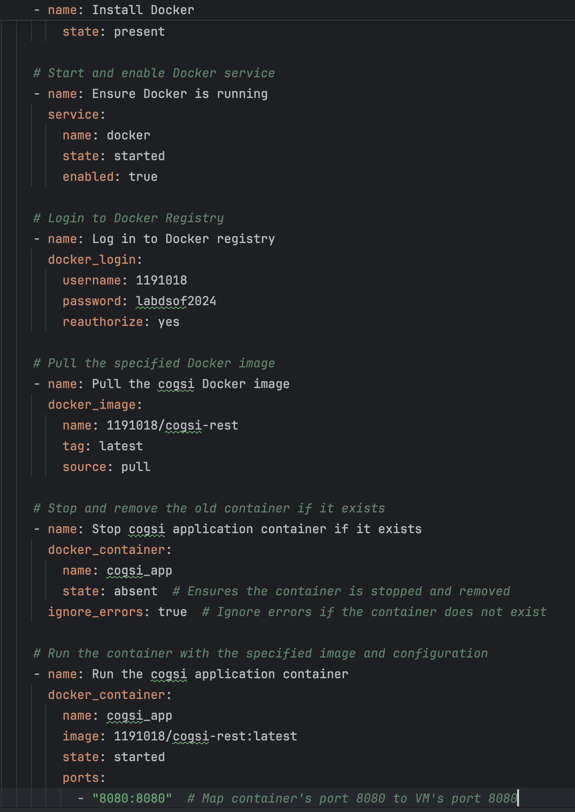

# Part 2

## Automate infrastructure setup - Ansible playbook will handle the deployment of the latest Docker image

First we created, a vagrant file with the following configuration:

    Vagrant.configure("2") do |config|

        config.vm.box = "bento/ubuntu-20.04"
        config.vm.hostname = "production-vm"
    
        config.vm.network "private_network", type: "dhcp"
    
        config.vm.provision "ansible" do |ansible|
            ansible.playbook = "playbook.yml"
        end

        config.vm.network "forwarded_port", guest: 8080, host: 1011
    end

* config.vm.box = "bento/ubuntu-20.04": Defines the base image or "box" for the VM.
* config.vm.hostname = Defines the host name as "production-vm".
* config.vm.network "private_network", type: "dhcp": Configures the VM's network settings to automatically assigns an IP address to the VM using DHCP.
* ansible.playbook = "playbook.yml": Indicates the name of the Ansible playbook (playbook.yml) that will be used to configure the VM.
* config.vm.network "forwarded_port", guest: 8080, host: 1011: Sets up port forwarding to allow access to rest service running inside the VM from the host machine.

In the playbook.yml we do following tasks:

1. Update apt packages: Ensures the system's package index is up to date.
2. Install Docker: We install docker.
3. Ensure Docker is running: Check if docker service started.
4. Log in to Docker registry: We use the credentials to login to docker hub.
5. Stop cogsi application container if it exists
6. Pull the docker image 1191018/cogsi-rest:lastest
7. Run a container with the previous image.

## Jenkins Pipeline Configuration

### Pipelines Stages

This Jenkins pipeline orchestrates the build, test, and deployment processes. Below is the breakdown of its stages:

1. Checkout(The same as in the part 1)

2. Assemble(The same as in the part 1)

3. Test

Executes unit tests and integration tests in parallel using separate Jenkins nodes for efficiency.
Publishes the results for each type of test in Jenkins, allowing developers to verify the build quality.

        stage('Test') {
            parallel {
                stage('Unit Tests') {
                    agent { label 'unit-test-node' } // Separate node for unit tests
                    steps {
                        dir('ca6/springApplication') {
                            echo 'Making gradlew executable'
                            sh 'chmod +x gradlew'
                            echo 'Running unit tests'
                            sh './gradlew test'
                            echo 'Publishing unit test results'
                            junit '**/build/test-results/test/*.xml'
                        }
                    }
                }

Runs these tests using the ./gradlew test command.

                stage('Integration Tests') {
                    agent { label 'integration-test-node' } // Separate node for integration tests
                    steps {
                        dir('ca6/springApplication') {
                            echo 'Making gradlew executable'
                            sh 'chmod +x gradlew'
                            echo 'Running integration tests'
                            sh './gradlew integrationTest'
                            echo 'Publishing integration test results'
                            junit '**/build/test-results/integrationTest/*.xml'
                        }
                    }
                }
            }
        }

Runs these tests using the ./gradlew integrationTest command.

- paralel
    - A Jenkins pipeline feature that allows multiple stages to run concurrently.
      Improves efficiency by leveraging separate nodes or agents for different test types.

- sh './gradlew test'
    - Executes the unit tests defined in the project. Gradle's test task scans for test classes.

- junit '**/build/test-results/test/*.xml':
    - Collects and publishes test results in Jenkins.
    - The ** syntax is a wildcard to match directories recursively, while *.xml matches all test result files.

4. Tag Docker Image

Builds a Docker image for the application and tags it with latest.
Uses docker build to package the application for containerization.

    stage('Tag Docker Image') {
        steps {
            script {
                echo "Building and tagging Docker image with tag:latest"
                sh "docker build -t cogsi-rest:latest ."
            }
    }

- docker build -t cogsi-rest:latest .:
    - docker build: Builds a Docker image from a specified Dockerfile.
    - -t cogsi-rest:latest: Assigns a name (cogsi-rest) and a tag (latest) to the image for identification.
    - .: Refers to the context directory where the Dockerfile resides.

5. Archive

Archives the Dockerfile, build artifacts, and metadata in Jenkins for traceability.
Ensures future builds or deployments can reference these files.

        stage('Archive') {
            steps {
                echo 'Archiving Dockerfile and related metadata'
                archiveArtifacts artifacts: '**/Dockerfile, **/build/libs/*.jar', allowEmptyArchive: false
            }
        }

- archiveArtifacts artifacts: '**/Dockerfile, **/build/libs/*.jar':
    - Archives files matching the specified patterns.
    - **: Matches directories recursively.
    - Dockerfile: Archives the Dockerfile used to build the image.
    - *.jar: Archives the JAR file created during the build.

6. Push Docker Image

Pushes the tagged Docker image to Docker Hub, making it available for deployment in different environments.
Uses secure credentials (dockerhub-credentials) stored in Jenkins for authentication.

    stage('Push Docker Image') {
        steps {
            script {
                echo "Pushing Docker image with tag: latest"
                withDockerRegistry(credentialsId: 'dockerhub-credentials', url: '1191018/cogsi-rest:latest') {
                    sh "docker push cogsi-rest:latest"
                }
            }
        }
    }

- withDockerRegistry:
    - A Jenkins pipeline feature that handles Docker authentication.
    - Uses credentialsId to retrieve stored Docker Hub credentials securely.

- docker push cogsi-rest:latest:
    - Pushes the Docker image (cogsi-rest:latest) to the Docker Hub repository.
    - Makes the image publicly or privately available for deployment in other environments.

7. Deploy (Production Deployment)(The same as in the part 1)
