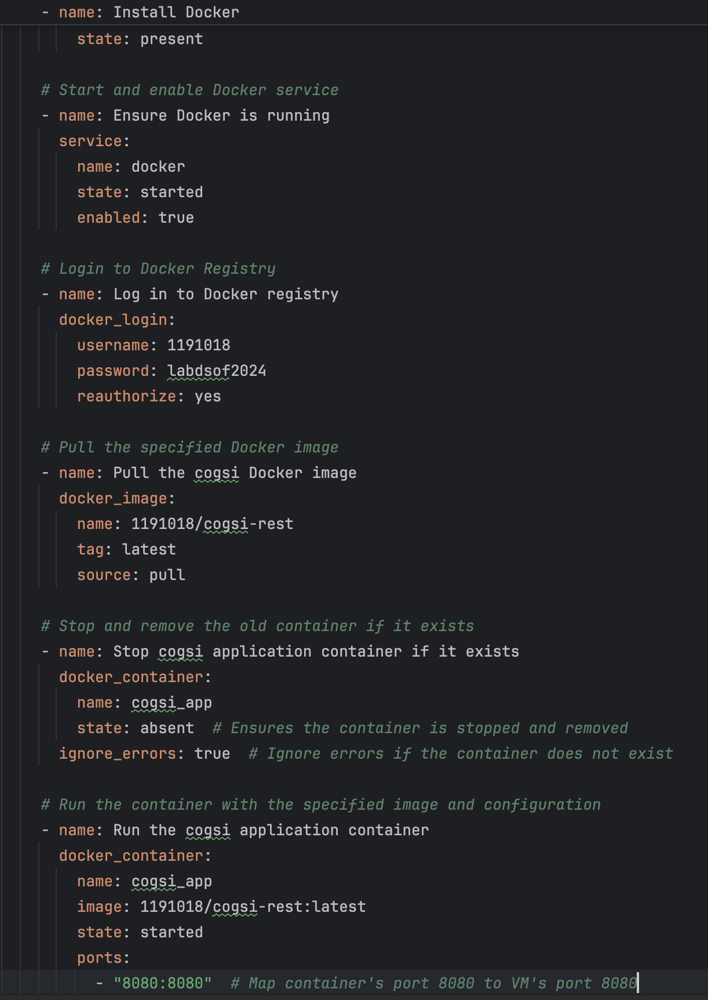

# Part 2

## Automate infrastructure setup - Ansible playbook will handle the deployment of the latest Docker image

First we created, a vagrant file with the following configuration:

    Vagrant.configure("2") do |config|

        config.vm.box = "bento/ubuntu-20.04"
        config.vm.hostname = "production-vm"
    
        config.vm.network "private_network", type: "dhcp"

        config.vm.network "forwarded_port", guest: 8080, host: 1011
    end

* config.vm.box = "bento/ubuntu-20.04": Defines the base image or "box" for the VM.
* config.vm.hostname = Defines the host name as "production-vm".
* config.vm.network "private_network", type: "dhcp": Configures the VM's network settings to automatically assigns an IP address to the VM using DHCP.
* config.vm.network "forwarded_port", guest: 8080, host: 1011: Sets up port forwarding to allow access to rest service running inside the VM from the host machine.

## Jenkins Pipeline Configuration

### Pipelines Stages

This Jenkins pipeline orchestrates the build, test, and deployment processes. Below is the breakdown of its stages:

1. Checkout(The same as in the part 1)

2. Assemble(The same as in the part 1)

3. Test

Executes unit tests and integration tests in parallel using separate Jenkins nodes for efficiency.
Publishes the results for each type of test in Jenkins, allowing developers to verify the build quality.

        stage('Test') {
            parallel {
                stage('Unit Tests') {
                    agent { label 'unit-test-node' } // Separate node for unit tests
                    steps {
                        dir('ca6/springApplication') {
                            echo 'Making gradlew executable'
                            sh 'chmod +x gradlew'
                            echo 'Running unit tests'
                            sh './gradlew test'
                            echo 'Publishing unit test results'
                            junit '**/build/test-results/test/*.xml'
                        }
                    }
                }

Runs these tests using the ./gradlew test command.

                stage('Integration Tests') {
                    agent { label 'integration-test-node' } // Separate node for integration tests
                    steps {
                        dir('ca6/springApplication') {
                            echo 'Making gradlew executable'
                            sh 'chmod +x gradlew'
                            echo 'Running integration tests'
                            sh './gradlew integrationTest'
                            echo 'Publishing integration test results'
                            junit '**/build/test-results/integrationTest/*.xml'
                        }
                    }
                }
            }
        }

Runs these tests using the ./gradlew integrationTest command.

- paralel
    - A Jenkins pipeline feature that allows multiple stages to run concurrently.
      Improves efficiency by leveraging separate nodes or agents for different test types.

- sh './gradlew test'
    - Executes the unit tests defined in the project. Gradle's test task scans for test classes.

- junit '**/build/test-results/test/*.xml':
    - Collects and publishes test results in Jenkins.
    - The ** syntax is a wildcard to match directories recursively, while *.xml matches all test result files.

4. Tag Docker Image

Builds a Docker image for the application and tags it with latest.
Uses docker build to package the application for containerization.

    stage('Tag Docker Image') {
        steps {
            script {
                echo "Building and tagging Docker image with tag:latest"
                sh "docker build -t cogsi-rest:latest ."
            }
    }

- docker build -t cogsi-rest:latest .:
    - docker build: Builds a Docker image from a specified Dockerfile.
    - -t cogsi-rest:latest: Assigns a name (cogsi-rest) and a tag (latest) to the image for identification.
    - .: Refers to the context directory where the Dockerfile resides.

5. Archive

Archives the Dockerfile, build artifacts, and metadata in Jenkins for traceability.
Ensures future builds or deployments can reference these files.

        stage('Archive') {
            steps {
                echo 'Archiving Dockerfile and related metadata'
                archiveArtifacts artifacts: '**/Dockerfile, **/build/libs/*.jar', allowEmptyArchive: false
            }
        }

- archiveArtifacts artifacts: '**/Dockerfile, **/build/libs/*.jar':
    - Archives files matching the specified patterns.
    - **: Matches directories recursively.
    - Dockerfile: Archives the Dockerfile used to build the image.
    - *.jar: Archives the JAR file created during the build.

6. Push Docker Image

Pushes the tagged Docker image to Docker Hub, making it available for deployment in different environments.
Uses secure credentials (dockerhub-credentials) stored in Jenkins for authentication.

    stage('Push Docker Image') {
        steps {
            script {
                echo "Pushing Docker image with tag: latest"
                withDockerRegistry(credentialsId: 'dockerhub-credentials', url: '1191018/cogsi-rest:latest') {
                    sh "docker push cogsi-rest:latest"
                }
            }
        }
    }

- withDockerRegistry:
    - A Jenkins pipeline feature that handles Docker authentication.
    - Uses credentialsId to retrieve stored Docker Hub credentials securely.

- docker push cogsi-rest:latest:
    - Pushes the Docker image (cogsi-rest:latest) to the Docker Hub repository.
    - Makes the image publicly or privately available for deployment in other environments.

7. Deploy (Production Deployment)

This section is similar to Part 1, but now it deploys just one playbook.

In the playbook.yml we do following tasks:

1. Update apt packages: Ensures the system's package index is up to date.
2. Install Docker: We install docker.
3. Ensure Docker is running: Check if docker service started.
4. Log in to Docker registry: We use the credentials to login to docker hub.
5. Stop cogsi application container if it exists
6. Pull the docker image 1191018/cogsi-rest:lastest
7. Run a container with the previous image.

### Post-Actions

This implementation is similar to Part 1 but now includes a new feature: an email notification 
section. This section triggers notifications under two conditions: on the successful completion 
of the pipeline and in the event of a failure. Notifications provide relevant details, such as 
the pipeline status and a link to the build, ensuring effective communication with developers.

The marked section represents the newly implemented features, while the remainder remains consistent with the content from Part 1.

### GitHub Webhook Integration

- Configures a webhook in GitHub to trigger the Jenkins pipeline automatically whenever a 
commit is pushed to the main or development branch.
- This ensures the CI/CD pipeline always processes the latest changes.

## Alternative Solution for Configuration Management: GitHub Actions

GitHub Actions is an automation tool tightly integrated into GitHub's ecosystem, offering robust capabilities for continuous integration and continuous delivery (CI/CD). It enables developers to automate, customize, and execute software development workflows directly in a GitHub repository.

### Comparison of GitHub Actions vs Jenkins

#### Integration and Ecosystem

GitHub Actions:

- Fully integrated with GitHub, offering seamless access to GitHub repositories, issues, and pull requests.
- Supports GitHub-hosted runners for automation, eliminating the need for separate server setup.
- Marketplace with thousands of pre-built actions for various tasks (e.g., testing, deployment, monitoring).
- Best suited for projects already hosted on GitHub.

Jenkins:

- Open-source and platform-agnostic, can be used with a wide variety of repositories and tools.
- Requires setup and maintenance of a Jenkins server (self-hosted or through a cloud provider).
- Wide plugin ecosystem, but integration requires additional configuration.
- Verdict: GitHub Actions is easier to use in GitHub-centric workflows, while Jenkins offers more flexibility for non-GitHub projects.

#### Ease of Use
GitHub Actions:

- Workflows are defined in YAML files, which are easy to read and version alongside code.
- Pre-configured GitHub-hosted runners reduce setup time.
- Low learning curve for developers familiar with GitHub.

Jenkins:

- Configuration can be more complex, requiring knowledge of the Jenkinsfile DSL or GUI configuration.
- Managing Jenkins servers, pipelines, and plugins adds overhead.
- Verdict: GitHub Actions offers a more streamlined setup and simpler configuration, especially for GitHub users.

#### Scalability

GitHub Actions:

- Scales via GitHub-hosted runners or self-hosted runners, with resource limits based on GitHub plans.
- Pricing and resource allocation depend on the repository's subscription level (e.g., free, Team, Enterprise).

Jenkins:

- Completely customizable and scalable based on infrastructure.
- Resource scaling depends on the hosting environment but requires manual setup.
- Verdict: Jenkins offers greater scalability for large, complex systems, while GitHub Actions is sufficient for most small-to-medium projects hosted on GitHub.

#### CI/CD Pipeline Features

GitHub Actions:

- Provides reusable workflows, matrix builds, and concurrent jobs.
- Built-in support for secret management, caching, and artifact handling.
- Integration with third-party tools via pre-built actions in the Marketplace.

Jenkins:

- Highly customizable pipelines through plugins.
- Supports parallelism and declarative/imperative pipeline styles.
- Extensive range of plugins for customization, which may occasionally introduce compatibility issues.
- Verdict: GitHub Actions simplifies CI/CD pipeline setup with pre-built integrations, while Jenkins offers deeper customization for advanced use cases.

#### Cost

GitHub Actions:

- Free for public repositories and limited workflows on private repositories (e.g., 2,000 minutes per month for free plans).
- Costs can rise with extensive usage of GitHub-hosted runners on private repositories.

Jenkins:

- Open-source and free, but operational costs (e.g., hosting, maintenance) are incurred based on infrastructure.
- Verdict: GitHub Actions is cost-effective for small teams, while Jenkins may be more economical for large teams with self-hosted infrastructure.

#### Conclusion

GitHub Actions is ideal for projects already hosted on GitHub, offering ease of use, tight integration, and sufficient CI/CD capabilities for small to medium projects. It shines in environments where simplicity and GitHub-native workflows are priorities.

Jenkins remains a more flexible and powerful tool for larger, complex projects that require custom setups, extensive plugin support, and integration across diverse environments.

For most GitHub-based projects, GitHub Actions would be the preferred solution due to its simplicity, ease of use, and cost-effectiveness. However, for organizations seeking complete control over their CI/CD pipelines, Jenkins might still be the better option.

## Implementation with the alternative: Github Actions

For the alternative implemention we used github actions and created the yml files inside the .github/workflows directory

## Part 1
For the first part use used the part1-pipeline.yml.

- Workflow Trigger
  - Triggers:
  

    push: Executes the pipeline when code is pushed to the repository.
    workflow_dispatch: Allows manual triggering of the workflow.

### Pipeline stages

1. Checkout: 

   Purpose: Fetches the repository code.

   Actions: Utilizes actions/checkout@v3 to clone the repository for subsequent operations.

2. Assemble: 

Purpose: Builds the application and generates artifacts.

Actions:
- Sets up Java 17 using actions/setup-java@v3.
- Ensures gradlew script is executable.
- Compiles the application and builds the project while skipping tests (gradlew clean build -x test).

3. Test

 Purpose: Runs unit tests to verify code correctness. 
 
Actions:
   
   - Re-checks out the repository and sets up Java 17.
   - Executes gradlew test to run tests.
   - Uploads test results as artifacts for review (actions/upload-artifact@v3).

4. Archive

Purpose: Archives the built artifacts for deployment.

Actions:
   - Renames the built JAR file with a version tag (app-stable-v1.<run_number>.jar).
   - Uploads the renamed artifacts using actions/upload-artifact@v3.

5. Deploy to Production
   
Purpose: Introduces a manual approval gate for production deployment.

Actions:

   - Prompts the user for manual approval to proceed with the deployment.

6. Deploy

Purpose: Deploys the application using Ansible.

Actions:

   - Installs Ansible on the runner.
   - Executes three Ansible playbooks (requirements_app_playbook.yml, db_playbook.yml, and app_playbook.yml) to configure and deploy the application to a Vagrant-based environment.

7. Verify Deployment

Purpose: Performs a health check to confirm successful deployment.

Actions:

   - Uses curl to verify that the application is running correctly by checking for an HTTP 200 response at http://192.168.33.10:8080/employees.
   - Fails the pipeline if the health check does not return a successful status.

## Part 2

# **CI/CD Pipeline Workflow Summary**

For the second part use used the part2-pipeline.yml.

This workflow automates the CI/CD process for building, testing, deploying, and verifying an application, with email notifications for pipeline success or failure.

## **Workflow Steps**

### 1. **Checkout**
- Pulls the source code from the repository.

### 2. **Assemble**
- Sets up Java 17.
- Makes the `gradlew` script executable.
- Compiles and builds the project, excluding tests.

### 3. **Test**
- Runs both unit and integration tests in parallel.
- Publishes the test results as artifacts.

### 4. **Tag Docker Image**
- Builds a Docker image and tags it.

### 5. **Archive**
- Archives Docker-related metadata and built artifacts.

### 6. **Push Docker Image**
- Pushes the Docker image to DockerHub.

### 7. **Deploy**
- Deploys the application using Ansible playbooks.
- This step runs only for the `main` branch.

### 8. **Verify Deployment**
- Runs health checks to ensure the application is functioning correctly.

### 9. **Notification**
- Sends an email notification for pipeline success or failure.
- Includes details like workflow name, build number, and repository URL.

